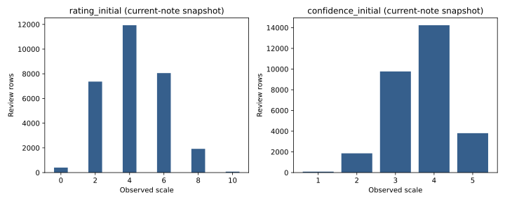

# Empirical facts — 第一轮诊断

以下均为2026所获快照样本，不代表完整ICLR人口，也不是因果。Observed指已存数据值；Constructed指本轮明示算法；外部制度事实见BLINDNESS_DESIGN的官方链接。所有聚合由code/audit.py和coverage.py实际运行生成，原项目不变。

1. **Observed：单年、不完整且按编号截断的样本。** raw有10,090篇，编号1–10,240缺150号；7,655篇有review，合并29,813行。缺其他年份，不能做single/double年度对比。公开submission表比snapshot大，不能把raw称全会议random sample。
2. **Observed：review结构集中于每篇4份。** 5,890篇4reviews；1,303篇3份、429篇5份，其余见表。是submitted reviews数，不是算法分配数；不能从absence读出拒绝assignment。
3. **Observed：连接率很高，但身份缺失不可忽略。** submission/current-review连接均29,766/29,813=99.8424%；reviewer profile ID连接27,470/29,813=92.1409%，有效content27,464。169,613/169,683 author slots有有效profile（99.9587%），slots重复按review计；无独立真实身份validation。
4. **Observed：current评分为离散偶数，confidence为1–5。** rating均值4.26547（N29,766，SD1.82892），confidence均值3.66552（SD.78820）。rating支持集0/2/4/6/8/10；正式锚点文案未确认。不能跨年标准化或把confidence当ex ante expertise。
5. **Observed：所谓final/initial是快照差。** 29,813 final content等于旧快照；29,766 initial等于后期note。配对样本1,881条不同，snapshot-current均值+.128133；1,792上升、89下降。不是直接的rebuttal change，不能归因泄露或私人联系。全部配对current note tmdate在release后，且raw version全为2。
6. **Constructed：机构/合作接近只具弱proxy含义。** dated-start domain overlap：26,030可定义行，均值6.26585%；undated coauthor overlap：27,307可定义行，112阳性（.41015%）。剩余分别3,783和2,506行unknown。非同期同机构、不一定prior coauthor；missing没有当0。
7. **Constructed：within-paper关联没有清楚的非零证据。** 下面四个预先限定的模型不含其他controls、paper FE通过demeaning，SE按paper聚类；只用同一paper内X有变化的complete cases，并去重1个paper-reviewer组合。无显著证据不等于不存在bias，更不能归纳为网络无效。
8. **Constructed：mixed-proximity论文分歧略大，不能作因果。** 见disagreement表；该表是至少2个可用review者、按paper均值比较SD，未控制研究领域、reviewer选择/宽严或样本selection。
9. **Observed/Constructed：arXiv有资料但不能衡量实际deanonymization。** main 7,655篇中3,433篇有matched arXiv，3093篇有早于所观测review创建时间的候选匹配；candidate只比较至少一条所观测review创建时间与首命中published，不证明实体正确或reviewer读过。NULL混合未查/失败/未命中。全submission notebook的4,397 hits是更宽样本且traced only，不能拿来当main覆盖率。
10. **Observed：现有pipeline主要是探索，不是主因果分析。** 未发现已执行DiD、主回归、embedding、真正accept模型；notes声称随机assignment无机制证据。gender/NamePrism缺准确率验证，当前不支持可靠demographic matching conclusion。

## 样本、分布与诊断表

|   reviews |     papers |
|----------:|-----------:|
|   2.00000 |    1.00000 |
|   3.00000 | 1303.00000 |
|   4.00000 | 5890.00000 |
|   5.00000 |  429.00000 |
|   6.00000 |   27.00000 |
|   7.00000 |    5.00000 |

| variable                     |     n |       mean |         sd |     min |         max |
|:-----------------------------|------:|-----------:|-----------:|--------:|------------:|
| rating_initial               | 29766 |    4.26547 |    1.82892 | 0.00000 |    10.00000 |
| rating_final                 | 29813 |    4.39372 |    1.89024 | 0.00000 |    10.00000 |
| confidence_initial           | 29766 |    3.66552 |    0.78820 | 1.00000 |     5.00000 |
| confidence_final             | 29813 |    3.67051 |    0.78798 | 1.00000 |     5.00000 |
| review_text_chars            | 29813 | 3021.08892 | 1475.04551 | 0.00000 | 24182.00000 |
| institution_overlap_snapshot | 26030 |    0.06266 |    0.24235 | 0.00000 |     1.00000 |
| coauthor_overlap_undated     | 27307 |    0.00410 |    0.06391 | 0.00000 |     1.00000 |

|           n |   different |   mean_snapshot_minus_current |   positive |   negative |   current_note_modified_after_release |   arxiv_matches |   arxiv_before_review_candidates |
|------------:|------------:|------------------------------:|-----------:|-----------:|--------------------------------------:|----------------:|---------------------------------:|
| 29766.00000 |  1881.00000 |                       0.12813 | 1792.00000 |   89.00000 |                           29766.00000 |      3433.00000 |                       3093.00000 |

| x                            | y                  |    n |   papers |    beta |   se_paper_cluster |   p_asymptotic | fe                                      | controls   | interpretation                                                    |
|:-----------------------------|:-------------------|-----:|---------:|--------:|-------------------:|---------------:|:----------------------------------------|:-----------|:------------------------------------------------------------------|
| institution_overlap_snapshot | rating_initial     | 4903 |     1325 | 0.07662 |            0.05232 |        0.14305 | paper demeaned; informative papers only | none       | descriptive association; snapshot timing and selection unresolved |
| institution_overlap_snapshot | confidence_initial | 4903 |     1325 | 0.01097 |            0.02339 |        0.63900 | paper demeaned; informative papers only | none       | descriptive association; snapshot timing and selection unresolved |
| coauthor_overlap_undated     | rating_initial     |  403 |      108 | 0.06617 |            0.20576 |        0.74778 | paper demeaned; informative papers only | none       | descriptive association; snapshot timing and selection unresolved |
| coauthor_overlap_undated     | confidence_initial |  403 |      108 | 0.08858 |            0.08414 |        0.29245 | paper demeaned; informative papers only | none       | descriptive association; snapshot timing and selection unresolved |

| x                            | mixed   |   papers |   mean_score_sd |
|:-----------------------------|:--------|---------:|----------------:|
| institution_overlap_snapshot | False   |     5907 |         1.46974 |
| institution_overlap_snapshot | True    |     1325 |         1.49066 |
| coauthor_overlap_undated     | False   |     7446 |         1.47342 |
| coauthor_overlap_undated     | True    |      108 |         1.54038 |

## WORK Step4逐项尝试记录

| 诊断 | 执行状态 | 原因/产物 |
|---|---|---|
| year sample/structure | completed | year_structure / reviews_per_paper |
| score/confidence distributions | completed | 四个distribution表及SVG |
| paper-level reviewer count | completed as observed reviews | 无完整assignment matrix；missing identity按review note计 |
| topic similarity distribution | not computable reliably | 无dated历史publication文本或existing similarity；self-report snapshot不偷换成官方affinity |
| similarity→confidence | not estimable | X缺失；confidence不充当X |
| similarity→score + paperFE | not estimable | 同上 |
| social prevalence | completed as limited proxies | domain snapshot与undated coauthor lists；缺真实prior时间 |
| social→score/confidence | completed descriptive only | 四个paper FE表；selection仍在 |
| reputation×regime contrast | not estimable | 无reputation/prestige构造、无single-blind组；不能凭角色造声誉 |
| expertise/proximity与disagreement | proximity aggregate completed；expertise pending | disagreement表；topic X缺失 |

无一项以伪造替代变量或人口学补推填空。下一轮最有价值的分析前提是历史edit血缘、合法dated publications、验证arXiv与assignment机制；暂不继续批量回归。
