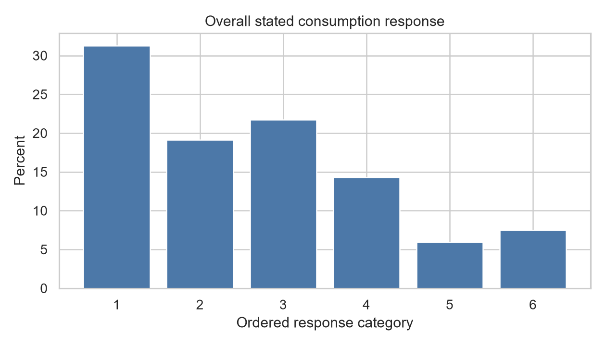
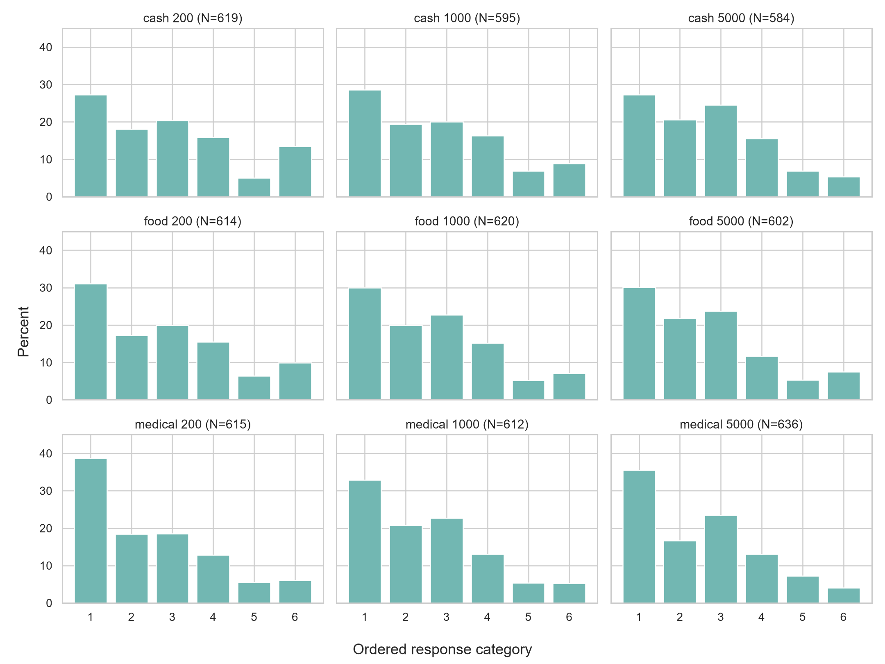
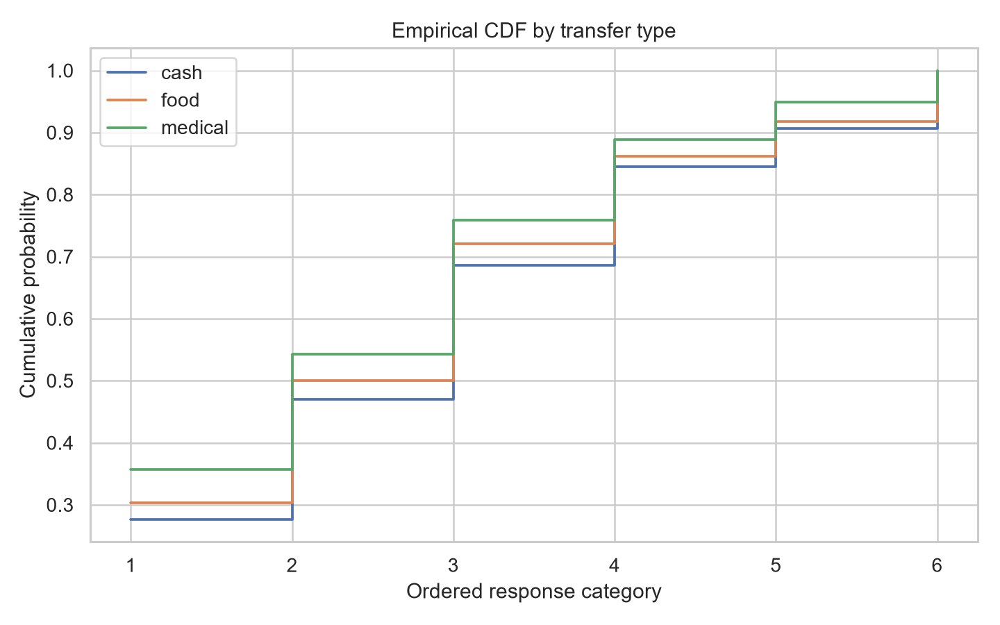

# 消费调查第一轮数据审计

## 审计范围与可复现性

本报告严格执行 `SPEC.md` 与 `WORK.md` 的第一轮要求，不扩展研究设计。审计输入为研究者指定的 Stata 交付文件 `社会心态小调研数据(1).dta`，并用同目录的 `社会心态小调查问卷（整合文字版）(1).docx` 核对题目、编码与随机情景映射。原始数据未被修改，也未复制到 GitHub。可复现代码见 `analysis/initial_audit.py`；仓库只保存代码、图和汇总结果。

问卷明确规定 Q32–Q34 为现金 200/1000/5000 元，Q35–Q37 为食品/日用消费券 200/1000/5000 元，Q38–Q40 为医保个人账户 200/1000/5000 元。审计据此重构 treatment，而不是依赖列名推断。

## 1 数据来源与结构

- 文件格式：Stata `.dta`，3,010,162 bytes。
- 原始样本：5,497 行，67 个交付字段；一行对应一名 respondent。
- ID：`id` 存在，缺失 0；重复 ID 0；完全重复记录 0。
- 除随机未呈现的八个 Q32–Q40 列外，所有交付字段非缺失。Q32–Q40 的单列缺失是随机设计的结构性缺失，不是 item nonresponse。
- 未交付调查时长、开始/结束时间、IP、设备、渠道或平台 quality flag，因此无法审计 speeders、设备/IP 重复或渠道质量。
- 同目录另有问卷文字版；`1sum.ipynb` 大小为 0 bytes，不构成已有清洗或分析代码。未发现平台导出说明、单独 codebook、已有表格、图或报告。

完整变量字典保存在 `tables/variable_dictionary.csv`。交付字段分组如下：

| 范围 | 实际字段 | 内容与编码 | 非缺失情况 | 问卷一致性 |
|---|---|---|---:|---|
| ID | `id` | 平台 respondent ID | 5,497 | 一致 |
| Q1–Q13 | `q01_lifesat` 至 `q13_pressure`，Q3 拆为 3 列 | 0–10 量表 | 各 5,497 | 一致 |
| Q14 | `q14a_pr_income` 至 `q14h_pr_none` | 多选拆列，0/1 | 各 5,497 | 一致 |
| Q15–Q22 | `q15_fut_self` 至 `q22_vitality`，Q17 拆为 5 列 | 主要为 0–10 量表 | 各 5,497 | 一致 |
| Q23–Q31 | `q23_hukou` 至 `q31_gotsubsidy` | 户籍、就业、住房、家庭、食品/医疗支出、既往补贴等分类变量 | 各 5,497 | 一致 |
| Q32–Q40 | `q32_cash200` 至 `q40_med5k` | 各情景 outcome 1–6；每人只填一列 | 每列 584–636 | 一致 |
| 情景派生字段 | `scen_version`, `scen_type`, `scen_amount`, `scen_mpc` | 版本 1–9、类型 1–3、金额、合并 outcome | 各 5,497 | 与 Q32–Q40 逐行完全一致 |
| Q41–Q49 | `q41_gender` 至 `q49_citytier` | 平台回传的性别、年龄、教育、行业、职业、收入、地域、城市级别 | 各 5,497 | 与问卷附录一致 |

两个编码注意事项：一是 `q46_income` 同时出现新版 1–6 与旧版 11–16，旧码仅 30 条（0.55%）；分析按问卷说明将 11–16 对应归并为 1–6。二是 `.dta` 的中文元数据在当前读取器中有乱码，但英文变量名、数值编码与问卷正文能够逐项对应；报告中的中文标签来自问卷文字版，不依赖乱码元数据。

## 2 样本质量与异常答卷

| 检查 | N | 占原始样本 |
|---|---:|---:|
| Q32–Q40 恰好一列非缺失 | 5,497 | 100.00% |
| Q32–Q40 全部缺失 | 0 | 0.00% |
| Q32–Q40 多列非缺失 | 0 | 0.00% |
| 重构情景与 `scen_*` 元数据不一致 | 0 | 0.00% |
| 重复 ID（涉及行数） | 0 | 0.00% |
| 完全重复记录 | 0 | 0.00% |
| Q1–Q13 的 15 个 0–10 项全部同值 | 311 | 5.66% |
| 年龄缺失或不在 18–100 | 17 | 0.31% |
| 关键分类变量越界 | 0 | 0.00% |
| outcome 不在 1–6 | 0 | 0.00% |

311 份量表完全同值答卷是最明显的质量信号，但不能在没有 timing/quality flag 的情况下断言为无效答卷，因此主分析保留。另有 17 人年龄为 14–17 岁；问卷材料没有提供成年人筛选条件，这里把它作为 eligibility concern，而不是把数据本身称为“不可能”。

候选 clean sample 仅用于稳健性：排除 311 份完全 straight-line 答卷、17 份年龄不在 18–100 的答卷及任何重复/assignment/编码异常；条件有重叠，剩余 N=5,171（94.07%）。不对原始文件做删除或覆盖。

## 3 3×3 assignment integrity 与 cell size

| Cell | Type | Amount | N | 样本占比 | 相对 N/9 偏离 |
|---:|---|---:|---:|---:|---:|
| 1 | cash | 200 | 619 | 11.26% | +8.2 |
| 2 | cash | 1000 | 595 | 10.82% | -15.8 |
| 3 | cash | 5000 | 584 | 10.62% | -26.8 |
| 4 | food | 200 | 614 | 11.17% | +3.2 |
| 5 | food | 1000 | 620 | 11.28% | +9.2 |
| 6 | food | 5000 | 602 | 10.95% | -8.8 |
| 7 | medical | 200 | 615 | 11.19% | +4.2 |
| 8 | medical | 1000 | 612 | 11.13% | +1.2 |
| 9 | medical | 5000 | 636 | 11.57% | +25.2 |

九组相对完全均匀分配的 Pearson chi-square 为 3.048（df=8，p=0.931）。cell 数量差异很小，没有 assignment failure 信号。

## 4 Randomization balance

平衡检查覆盖性别、年龄、学历、月收入、户籍、工作状态、单位类型、住房、子女、家庭人数、食品/医疗支出、既往补贴、省份、城市级别、Q6、Q7、Q13、Q15–17。连续变量用组间均值检验并报告标准化范围，分类变量用列联表检验；另以预定义 covariates 预测九组 assignment，做 multinomial-logit likelihood-ratio omnibus test。

- 联合检验：LR chi-square=378.54，df=376，p=0.454，整体不拒绝随机正交性。
- 单项中最小 p 值为九组间城市级别 p=0.017；按 type 汇总为 p=0.036。年龄按 amount p=0.043、按九组 p=0.046，但九组均值最大差仅 0.156 SD。
- 其余预定义平衡检验没有 p<0.05。考虑到多重比较及 omnibus 结果，不把城市级别或年龄的孤立差异解释为随机化失败。

结论：assignment integrity 与整体平衡支持把 treatment assignment 视为可信随机化。为提高 precision，first look 同时报告预定义 controls；加入 controls 后 treatment pattern 没有剧烈变化。

## 5 Outcome coding 与分布

主 outcome `outcome_ord` 保持问卷原始 1–6 档：1=基本不额外消费；2=<10%；3=10–25%；4=25–50%；5=50–75%；6=>75%。全样本分布如下：

| Category | N | 比例 |
|---:|---:|---:|
| 1 | 1,721 | 31.31% |
| 2 | 1,053 | 19.16% |
| 3 | 1,196 | 21.76% |
| 4 | 787 | 14.32% |
| 5 | 328 | 5.97% |
| 6 | 412 | 7.49% |

存在实质性 floor concentration（31.31%），但没有对称的 ceiling problem（7.49%）。九组均有六档观测，没有异常断层；medical 三组第 1 档比例更高，type-level 分别为 cash 27.70%、food 30.39%、medical 35.70%。完整 cell/type/amount 分布见 `tables/`。

辅助 `mpc_midpoint` 使用 0、0.05、0.175、0.375、0.625、0.875；把最后一档改为 1.0 的 alternative coding 不改变排序。该映射只用于经济量级直观化，不作为主要结论。

## 6 样本构成与外部有效性

- 年龄均值 33.20，中位数 32，P10/P90 为 22/46，范围 14–81；样本明显偏年轻。
- 女性 52.96%，男性 47.04%。
- 大学本科 49.01%，大专 25.10%，硕士及以上 4.80%；大专及以上合计 78.92%，样本明显偏高学历。
- 在职 70.29%，退休 14.70%，在校学生 8.15%，失业/待业 3.27%。
- 农业户籍 47.75%，非农业户籍 51.26%。一线与二线城市合计 57.81%。

这些是平台样本构成描述，不等于与全国基准的正式偏差估计；本轮未接入权威人口基准，也未做权重调整，不能声称样本代表全国居民。

## 7 Precision

每组 ordinal mean 的 SE 为 0.058–0.068，95% CI 半宽约 0.114–0.133 档。按金额比较 food-cash 的 80% power、5% 双侧粗略 MDE 为 0.241–0.265 档；medical-cash 为 0.235–0.257 档。主效应可达到有用精度，但单金额 interaction 与小 subgroup 精度有限。食品券 likely-binding 分类只有 food N=27、cash N=29，几乎没有能力排除中等效应。

## 8 最重要的数据限制

1. outcome 是一次性 hypothetical stated response，不是实际消费；不能写成 realized MPC。
2. 31.31% 地板集中压缩了连续量级信息，且第 6 档为开放上界，midpoint MPC 依赖编码假设。
3. 没有 survey duration、开始/结束时间、设备/IP、渠道或平台 quality flag，无法识别 speeders 与设备级重复。
4. 食品支出只有月度分档，6 个月支出必须用 bounds 构造；边界分类不能当作精确预算约束。
5. 医疗支出是过去一年 OOP，而医保账户长期有效；只能作为需求/风险 proxy，不能机械复制食品券的 bindingness 解释。
6. 平台样本年轻且高学历，外部有效性未知；没有人口权重依据。
7. baseline subgroup interactions 不是独立 causal mechanism identification；小 subgroup 尤其缺乏 precision。

综合判断：数据结构完整、随机化可信，没有 fatal assignment concern；主要风险来自 stated/粗分档 outcome、质量字段缺失与样本选择，而不是 3×3 执行失败。
