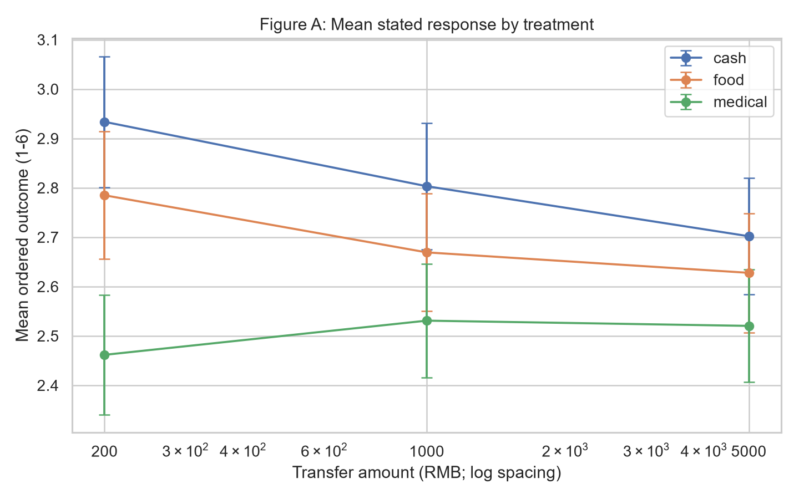
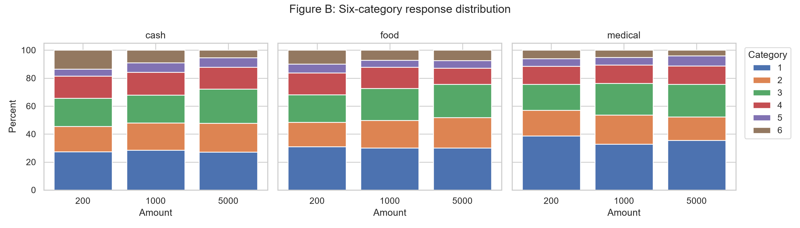

# 消费调查 First Look

本报告只做 `WORK.md` 指定的最小 first look。所有数值来自 5,497 份原始答卷；clean candidate（N=5,171）和预定义 controls 仅用于稳健性。结果描述的是“预计额外消费”的问卷回答，不是实际消费、偏好或福利。

## 1 Cash food medical 是否肉眼有差异

有。按 type 合并后，原始 ordinal mean 为 cash 2.815、food 2.694、medical 2.505；辅助 midpoint MPC 分别为 0.227、0.208、0.178。CDF 与六档分布显示 medical 整体向低反应移动：第 1 档占比 cash 27.70%、food 30.39%、medical 35.70%。

差异主要是 medical vs cash；food vs cash 较小。按 200 元基准 cell，food-cash=-0.149 档（95% CI -0.334, 0.037），medical-cash=-0.472（95% CI -0.651, -0.292）。这不是 pooled average treatment contrast，而是 interaction parameterization 下 200 元的差异。

## 2 Amount 从 200 到 1000 到 5000 的变化

| Type | 200 mean | 1000 mean | 5000 mean | 5000−200（95% CI） |
|---|---:|---:|---:|---:|
| cash | 2.934 | 2.803 | 2.702 | -0.232 [-0.409, -0.054] |
| food | 2.785 | 2.669 | 2.628 | -0.157 [-0.334, 0.020] |
| medical | 2.462 | 2.531 | 2.520 | +0.059 [-0.107, 0.225] |

cash 与 food 随金额增加呈温和下降，medical 基本平坦。midpoint MPC 的九组均值亦保持相同排序：cash 0.253→0.227→0.201，food 0.228→0.201→0.195，medical 0.177→0.179→0.179。把第 6 档由 0.875 改为 1.0 不改变方向。

## 3 是否有明显 type × amount interaction

视觉上存在候选 interaction：medical 在 200 元时低于 cash 最多，金额增大后差距收窄；cash/food 则向下。未控制 ordinal OLS 的四个 interaction 项联合 Wald chi-square=6.476（df=4，p=0.166），因此整体证据不强，不能把一条单独显著系数当作已确认 interaction。

加入预定义 controls 后 pattern 相近：200 元 medical-cash=-0.501；medical×1000 相对项 +0.252，medical×5000 相对项 +0.312。clean candidate 中九组均值也保持结构：cash 2.963/2.823/2.709，food 2.783/2.698/2.655，medical 2.461/2.507/2.561。换言之，medical 的平坦 gradient 对明显 straight-liner 与未成年人排除不敏感，但正式 interaction 的 precision 仍不足。

## 4 Clearly inframarginal households 中 food 是否仍区别于 cash

按照月食品支出分档上下界乘以 6 构造 bounds：transfer 低于六个月支出下界为 definitely inframarginal，落在区间为 ambiguous，高于上界为 likely binding。对于开放的 5000+ 档，上界保持开放，因此不会武断判为 binding。

| 分类 | N food | N cash | Food mean | Cash mean | Food−cash（95% CI） |
|---|---:|---:|---:|---:|---:|
| Definitely inframarginal | 1,642 | 1,620 | 2.750 | 2.873 | -0.123 [-0.231, -0.014] |
| Ambiguous | 167 | 149 | 2.240 | 2.396 | -0.156 [-0.485, 0.173] |
| Likely binding | 27 | 29 | 2.111 | 1.759 | +0.352 [-0.242, 0.947] |

答案是“有一个小的负向差异候选”：在 clearly inframarginal 组，food 仍比 cash 低 0.123 档，而不是更高。它与简单的“用途限制刺激额外消费”故事方向相反，但能说明 fungibility 不能仅凭 cell mean 下结论。该异质性基于 baseline spending，不是独立随机机制；而真正 likely-binding 组只有 56 人，方向不稳且 CI 很宽。

## 5 Medical 是否呈现不同于 food 的模式

是，最清楚的区别是 amount gradient：food 从 200 到 5000 下降 0.157 档，medical 变化仅 +0.059 档。medical 在 200 元显著低于 cash/food，但到 5000 元差距缩小。过去一年医疗支出只能作为风险/需求 proxy：高医疗支出组的 medical-cash=-0.198 [95% CI -0.362, -0.034]，低医疗支出组为 -0.387 [-0.510, -0.264]。这与“更可能使用医保余额者反应差距较小”相容，但不是严格 bindingness 或 precautionary-saving 识别。

## 6 最强的 2–3 个异质性事实

1. **Food inframarginal：** clearly inframarginal households 中 food-cash=-0.123 档 [-0.231, -0.014]，N=3,262。样本大、bounds 定义保守，是最值得复核的异质性事实，但方向不支持“食品券更刺激”。
2. **既往医疗需求：** high past medical spending 组 medical-cash=-0.198，low 组=-0.387，组间差约 0.189 档。经济含义清楚，但 Q30 与长期账户期限不匹配。
3. **收入：** 高收入半样本 medical-cash=-0.500，低收入半样本=-0.226，组间差约 -0.274 档。这是筛查中较大的 interaction，但收入存在新旧平台编码，需要在下一轮用统一原始金额题复核。

Q6 社保保护、Q7 应急流动性、年龄、子女与 Q17 预期的 medical-cash 分层差异均较小（约 0.00–0.11 档的组间变化），不构成同等强度的 mechanism evidence。

## 7 最不稳健的结果

- likely-binding food subgroup 仅 food N=27、cash N=29，估计 +0.352 但 95% CI [-0.242, 0.947]；不能据此讲 bindingness 故事。
- formal type×amount joint test p=0.166；medical 的独特 gradient 是视觉和点估计事实，interaction 推断仍偏弱。
- 收入异质性依赖平台分档与新旧码归并，且是 exploratory split。
- midpoint MPC 对开放第 6 档没有精确上界；虽 alternative top coding 不改排序，但不能把其小数点当作精确 MPC。

## 8 样本和 measurement 最大问题

最大 measurement 问题是 hypothetical、粗分档、带地板集中的 stated outcome：31.31% 选择“基本不额外消费”。最大样本问题是平台样本年轻（均值 33.2）且高学历（大专及以上 78.9%），且没有 timing/IP/device/quality flags。现有 precision 足以识别约 0.24–0.27 档的单金额 type difference，但不足以稳定估计小 subgroup interaction。

## 9 现有数据最支持哪条主线

现有数据最支持“不同形式转移产生不同的 stated consumption response，尤其 medical account 整体较低且 amount gradient 与 cash/food 不同”这一 reduced-form 主线。它还不支持更强的 precautionary-saving 机制结论，也不支持“受限转移更刺激消费”的简单叙事。Food 的 clearly inframarginal 结果值得作为 non-fungibility 检验继续追踪，但当前方向是 food 低于 cash。

## 10 下一轮最值得新增的 3–5 项

这些优先项直接回应本轮暴露的 measurement/identification 缺口，不扩展成新的论文设计：

1. 连续金额或更细区间，并明确 >75% 档上界；最好同时记录计划消费、储蓄和还债分解。
2. 与期限匹配的 baseline category spending：食品 6 个月、医疗账户预期使用期内的医疗需求/余额/可报销范围。
3. transfer 可用性与理解检查：是否有医保个人账户、能否给家人使用、对消费券有效期与品类限制的理解。
4. 直接但简短的机制测量：mental-account label、salience、流动性约束和预防性储蓄动机，各自避免大量无约束心态题。
5. 平台质量字段与预设排除规则：时长、设备/IP 去重、渠道、attention/理解题，并统一收入编码。

## 结论

- **Strong facts:** 随机化执行完整且总体平衡；medical 的 stated response 低于 cash/food；cash/food 随金额上升而下降、medical 基本平坦；31.31% 的 floor concentration；clearly inframarginal 组 food 仍略低于 cash。
- **Weak / uncertain facts:** 正式 type×amount joint interaction；收入和既往医疗支出异质性；likely-binding food subgroup；任何依赖 midpoint 的精确 MPC 量级。
- **Fatal concerns (if any):** 没有随机化失败这一 fatal concern；但 stated outcome、地板集中、缺少质量字段与外部有效性不足，会阻止当前结果直接升级为强机制或福利结论。
- **Next design priorities:** 改善 outcome 测量；补期限匹配的 baseline spending/账户信息；加理解与质量检查；统一收入编码；只围绕 food fungibility 与 medical 的独特 gradient 做有针对性的下一轮测量。
