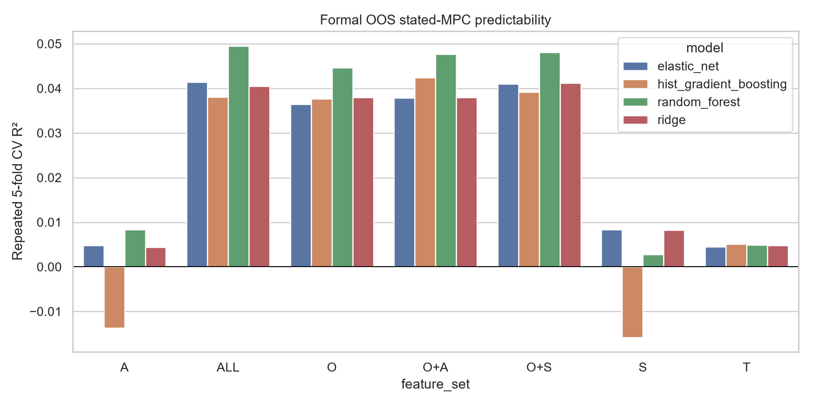
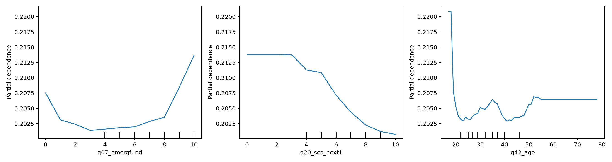
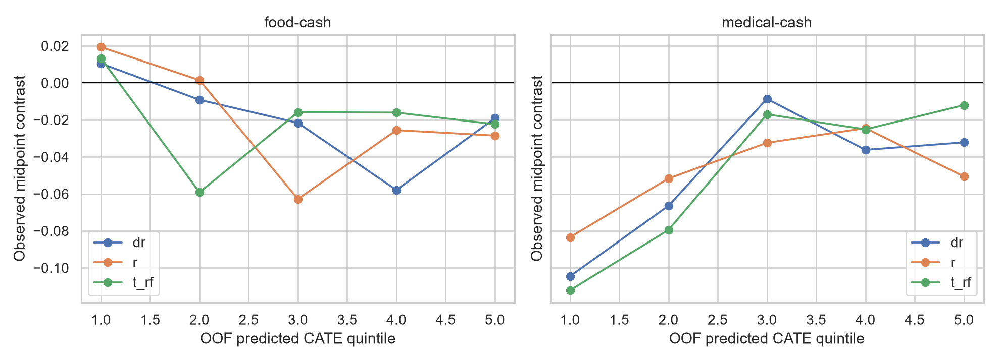

# 消费调查第二轮正式异质性结果

本报告只陈述规格修正后的事实、失效结果与预测表现，不预先确定论文故事。

## I. How much of stated-MPC variation is predictable?

Classical fixed models（midpoint stated MPC）：

| Set | In-sample R² | Adjusted R² | 10-fold CV R² |
|---|---:|---:|---:|
| T | .009 | .008 | .007 |
| O | .061 | .052 | .039 |
| S | .017 | .013 | .009 |
| A | .014 | .010 | .007 |
| O+S | .068 | .056 | .041 |
| O+A | .066 | .054 | .039 |
| ALL | .073 | .058 | .040 |

相对 T，O 的 10-fold incremental R² 约 .032；O→O+S 只增加 .002，O→O+A 约 0，O→ALL 只增加 .001。总 midpoint variance=.0663；未解释部分只能称为 unexplained / latent-or-noise component。

统一 2×5-fold nested-CV 的最佳结果是 ALL random forest，R²=.050、RMSE=.251、MAE=.194。O-only RF R²=.045，O+S=.048，O+A=.048；S-only 最佳约 .008，A-only 最佳约 .008。非线性模型没有把 baseline observables 的可预测份额提升到很高水平。

## II. Which individual observables survive joint modeling?

Correct factor coding 后，最大的单变量 adjusted-R² increments 是 food spending .026、medical spending .013、work-unit type .009、income .008、household size .007。这些是 level predictive associations，不是 causal effects。

ALL RF holdout permutation importance 首位是 food spending（.023），其次是 treatment type（.010）；medical spending、liquidity、prior subsidy、household size、housing、work status 等各自贡献很小。复杂 nonlinear model 的整体 OOS R² 仍仅 .050。

## III. Is Food−Cash fungibility heterogeneity predictable?

平均 pooled Food−Cash 为 -0.119 ordinal category [−0.221, −0.017]，midpoint effect=-.0189 [−.0361, −.0016]；R/A/C 方向一致。

但 observables 对该 gap 的排序不成立：

- T-learner calibration=-.251 [−.662,.160]，top-bottom=-.0357 [−.0937,.0223]。
- DR calibration=-.675 [−1.334,−.017]，top-bottom=-.0296 [−.0851,.0260]。
- R learner calibration=-.957 [−1.822,−.091]，top-bottom=-.0478 [−.1031,.0074]。

负 calibration 不是反向机制的可靠证据；三种 learner 的 observed top-bottom CI 均跨 0，说明模型排序没有在 held-out data 中正向复现。

Strict inframarginal N=3,262、very-strict N=2,899。预设八个 traits 的 BH q 分别均≥.876 与≥.916。Trend variables 的 95% CI half-width 大多为 .11–.14 ordinal category/SD：数据可以排除非常大的线性 HTE，但不能证明微小异质性为零。

## IV. Is Medical−Cash heterogeneity predictable?

平均 pooled Medical−Cash=-.309 ordinal category [−.408,−.209]；midpoint=-.0485 [−.0649,−.0320]。

Primary trend scan 中 income (-.118, q=.062)、city tier (+.109, q=.062)、education (-.102, q=.072) 和 medical spending (+.117, q=.085) 达到 q<.10；这些需要与 factor/omnibus 和 amount saturation 一起解释。

Held-out HTE：

- T-learner calibration=.671 [.307,1.035]，top-bottom midpoint separation=.100 [.046,.155]。
- DR calibration=.717 [.268,1.166]，top-bottom=.072 [.019,.126]。
- R learner calibration=.696 [−.214,1.606]，top-bottom=.033 [−.021,.087]。

两个 learner 正向复现，R learner方向相同但不精确。因此可陈述“Medical−Cash 存在部分可预测的多变量 HTE”，但不能把任一 feature importance 当成机制。

## V. Why does Medical differ from Food?

Pooled trend HTE（每 1 SD）：income −.153 [−.254,−.052], q=.007；education −.149 [−.249,−.049], q=.007；past medical spending +.136 [.033,.239], q=.029。2,000-permutation randomization p 分别 .0045、.0055、.0110。

三变量联合后（R sample）：

| Variable | Unadjusted joint | Prespecified controls | Province FE |
|---|---:|---:|---:|
| Income | −.146 [−.251,−.041] | −.137 [−.241,−.033] | −.140 [−.245,−.035] |
| Education | −.112 [−.215,−.010] | −.107 [−.208,−.006] | −.113 [−.217,−.010] |
| Medical spending | +.159 [.056,.263] | +.135 [.033,.238] | +.150 [.046,.254] |

在 Sample C，income 与 medical spending 保留，education CI 略跨 0。Ordered logit/probit 与 threshold checks 的主方向一致。

完全饱和 Type×Amount×X 显示 strongest HTE 主要集中于 200 元：income −.251 [−.439,−.063]；medical spending约 +.256（第一轮 amount scan）且正式饱和检查同方向。1000/5000 元更弱。因此 pooled Medical−Food pattern 存在，但不能称为 amount-invariant。

Category omnibus 进一步限制了解释：education factor omnibus 在 R p=.017、C p=.129；income R p=.126；medical spending R p=.092、C p=.035。Trend 是有信息的 parsimonious summary，但非线性 category pattern 的 sample stability 不完全。

## VI. Robustness

- Samples：average effects 与关键 trend HTE 在 R/A/C 方向一致；education joint effect 在 C 较弱。
- SE：HC1/HC3 基本一致。Province/city clustering 不改变 income 的 200 元结果；部分 medical-spending joint Wald 对 city clustering 较敏感。
- FE：province 与 city-tier FE 不改变主要方向。City FE 因 median city N=7、仅 23.1% 城市有九格而未使用。
- RI：三个 Medical−Food target 的 p=.0045–.011。
- Ordinal models：ordered logit/probit与线性 ordinal score 同方向；threshold effects 量级不同，说明变化并非均匀跨阈值。
- Categorical correction：hukou factor HTE omnibus 在 R/C 分别 p=.005/.009，值得作为未定位方向的整体 pattern；work status、unit type、housing、gender、minor child 等 omnibus 不显著。

## ReStud 2026 benchmark

| Dimension | Lewis et al. (2026 ReStud) | Our survey |
|---|---|---|
| MPC source | Realized spending response to 2008 rebate; GMLR-recovered MPC distribution | Directly elicited six-category hypothetical stated MPC |
| Transfer variation | Rebate receipt/timing | Randomized transfer form × amount |
| Heterogeneity method | Latent-group GMLR then WLS projection | Direct outcome prediction plus randomized HTE/CATE |
| Observables | Financial/demographic characteristics | Objective, subjective-economic and broader-attitude baseline variables |
| Explained variation | About 6% adjusted R²; about 8% with measurement-error correction | Adjusted R²=.058, best OOS R²=.050; not numerically comparable |
| Interpretation | Standard observables capture little MPC heterogeneity | Tests whether richer subjective information adds OOS prediction; it adds little here |

两者都问 observables 能捕捉多少 MPC heterogeneity，但 measurement objects materially differ；本项目没有机械复制 GMLR，也不声称复现其 8%。

## A. Facts that survived the formal re-analysis

1. **Stated-MPC level predictability is low.** ALL RF OOS R²=.050；Sample R；统一 nested CV。
2. **Objective/needs dominate level prediction.** O RF=.045，ALL=.050；S/A incremental value很小。
3. **Pooled Food−Cash average effect is negative.** −.119 [−.221,−.017], p=.022；R/A/C稳定。
4. **Pooled Medical−Cash average effect is negative.** −.309 [−.408,−.209], p<.001；R/A/C稳定。
5. **Income predicts Medical−Food HTE.** −.153 [−.254,−.052], p=.003, q=.007, RI p=.0045；joint controls/FE稳定。
6. **Education predicts Medical−Food HTE, with sample caveat.** −.149 [−.249,−.049], p=.004, q=.007, RI p=.0055；C joint CI略跨0。
7. **Past medical spending predicts Medical−Food HTE.** +.136 [.033,.239], p=.010, q=.029, RI p=.011；joint/FE稳定。
8. **Medical−Food HTE is amount-dependent.** 饱和 joint tests支持 HTE，但最大量级集中在200元。
9. **Medical−Cash HTE calibrates OOS.** T/DR calibration均正，top-bottom分别 .100与.072 midpoint units。
10. **Food−Cash HTE does not positively calibrate OOS.** 三 learner top-bottom CI均跨0。

## B. Findings that disappeared after correct categorical coding / controls

- Work status、work-unit type、housing、gender、minor-child 的数字标签 slope 不再是合法 HTE finding；formal factor omnibus 均不支持稳定 form HTE。
- Income/education/medical-spending 的 pooled trend没有消失，但 factor omnibus与 clean sample 显示非线性 category pattern 比第一轮 trend结论更脆弱。
- 第一轮单金额候选不能独立 headline；饱和模型显示多数不是跨金额稳定效应。
- A-only medical-cash 的 first-pass calibration不能被解释为若干单独 attitude mechanisms。

## C. Predictability facts

- Treatment-only OOS R²：.005。
- O incremental OOS R²：约 .040（RF；相对 T）。
- S incremental OOS R²：约 .003（最佳 S 减 T）。
- A incremental OOS R²：约 .003。
- ALL OOS R²：.050（RF）。
- Best nonlinear ML OOS R²：.050，ALL random forest。

## D. HTE predictability

- Food−Cash：没有正向 honest calibration；三 learner 的 top-bottom CI均跨0。
- Medical−Cash：T-learner calibration=.671 [.307,1.035]、top-bottom=.100 [.046,.155]；DR=.717 [.268,1.166]、top-bottom=.072 [.019,.126]；R learner方向同但不显著。结论得到两个 learner 支持。

## E. Strong nulls

- S/A 单独只能解释约 .008 OOS R²，在 O 之外的增量约 0–.005。
- Strict/very-strict inframarginal food sample 的八个预设 HTE traits全部 q≥.876/.916；典型 95% CI half-width=.11–.14 ordinal category/SD。
- Food−Cash CATE ranking没有 held-out positive calibration。
- Work status、unit type、housing、gender、minor child 的 formal factor HTE omnibus为 null。

## F. Candidate research interpretations

1. **Observables explain little stated-MPC variation.** 数据支持 objective/needs 比 subjective/attitudes 更有预测力；不识别剩余部分是偏好、约束还是 survey noise。与 ReStud benchmark问题相似，但 outcome不可比，且该事实不是 transfer-form-specific。
2. **Medical-account response has partially predictable form-specific HTE.** 数据支持 Medical−Cash 的多变量 held-out排序和 Medical−Food 的 income/education/medical-spending pattern；不识别这些 baseline traits 的因果机制，且部分 pattern集中于200元。
3. **Food non-fungibility lacks observed subgroup structure.** 数据支持平均 Food−Cash gap，但不支持由现有 observables稳定排序；与一般 MPC level prediction不同，这是 transfer-form-specific null。

全篇仅涉及 hypothetical stated MPC 与 randomized transfer-form effects，不涉及 realized MPC、welfare、cash-equivalent valuation、income/attitude 的因果效应或已证实的 latent preference mechanism。
