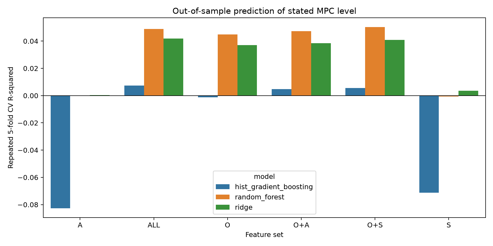
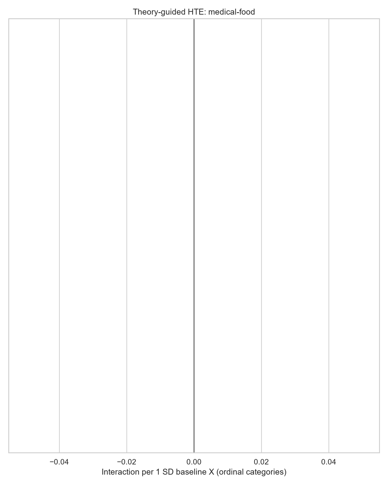
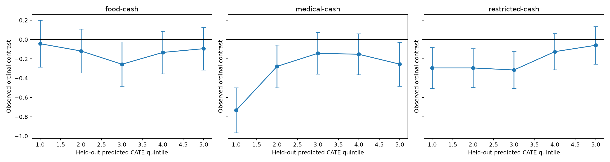

# 消费调查异质性探索结果

## 结论先行

异质性结构并不支持一个简单的“流动性约束解释一切”故事。Stated MPC level 与家庭食品/医疗支出、收入、教育等 objective conditions 稳定相关，但全部 baseline information 的 out-of-sample 解释度仍只有约 5%。Food-cash fungibility heterogeneity 基本不可复现，是重要 null。Medical 相关的 transfer-form heterogeneity 更明显：尤其 medical vs food 的差异随收入、教育和既往医疗支出系统变化；medical-cash 也存在可由 held-out ML 排序的异质性，但单一解释变量多未通过 family FDR。

## A Who has a high stated MPC

### 最强 objective / needs predictors

每个 effect 是 baseline X 增加 1 SD 后，控制随机 type×amount 的 `outcome_ord` level association：

| Variable | Effect | 95% CI | Family q | N |
|---|---:|---:|---:|---:|
| Monthly food spending | +0.259 | [0.217, 0.301] | <0.001 | 5,497 |
| Annual OOP medical spending | +0.172 | [0.129, 0.215] | <0.001 | 5,497 |
| Monthly income | +0.145 | [0.103, 0.188] | <0.001 | 5,497 |
| Education | +0.126 | [0.084, 0.168] | <0.001 | 5,497 |
| Household size | +0.089 | [0.047, 0.130] | <0.001 | 5,497 |

这些是 level associations，不是 income、education 或 spending 的因果效应。Food spending 是最稳定的 predictor，也在 holdout permutation importance 中排名第一。

### 最强 subjective / attitude predictors

- Emergency liquidity Q7：+0.069 [0.024, 0.113]，q=0.020。
- Sense of gain Q9：+0.068 [0.023, 0.112]，q=0.020。
- Welfare outlook Q17e：+0.061 [0.017, 0.104]，q=0.028。
- Social order Q21：+0.074 [0.031, 0.116]，q=0.008。

这些小幅 association 在单变量模型中存在，但 predictive incremental value 很弱。

### Out-of-sample predictive comparison

| Feature set | Ridge R² | Random forest R² | HistGradientBoosting R² |
|---|---:|---:|---:|
| O | 0.04 | 0.04 | -0.00 |
| S | 0.00 | -0.00 | -0.07 |
| A | 0.00 | 0.00 | -0.08 |
| O+S | 0.04 | 0.05 | 0.01 |
| O+A | 0.04 | 0.05 | 0.00 |
| ALL | 0.04 | 0.05 | 0.01 |

Objective conditions 已经提供几乎全部可预测信号；S 或 A 加到 O 后最多增加约 0.01 R²。ALL 也只能解释约 5% 的 out-of-sample variation，所以“谁的 stated MPC 高”仍主要是低可预测问题。

## B Who responds differently to transfer form

### Medical vs food 是最稳定的 theory-guided HTE

| Baseline X (per SD) | Medical−food HTE | 95% CI | Family q | Raw/clean and coding robustness |
|---|---:|---:|---:|---|
| Monthly income | -0.153 | [-0.254, -0.052] | 0.018 | sign 14/14；11/14 p<.05 |
| Education | -0.149 | [-0.249, -0.049] | 0.018 | sign 14/14；10/14 p<.05 |
| Past OOP medical spending | +0.136 | [0.033, 0.239] | 0.039 | sign 14/14；12/14 p<.05 |

Ordered-logit interactions 同方向：income -0.155 [-0.273, -0.037]；education -0.156 [-0.273, -0.038]；medical spending +0.171 [0.053, 0.289]。Regularized interaction models 也把 medical×medical-spending、medical×income 和 food×education 放在较稳定的项中。

解释上只能说：收入/教育越高，medical 相对 food 的 stated response 越低；既往医疗支出越高，medical 相对 food 越接近或更高。它不证明 income、education 或 medical need 本身造成了该反应。

### Amount dependence

部分 HTE 集中在特定金额：

- 200 元：food spending 对 medical-food 的 interaction 为 -0.271 [-0.452, -0.091]，q=0.013；medical spending 为 +0.256 [0.066, 0.445]，q=0.016。
- 1000 元：education 对 medical-food 为 -0.262 [-0.433, -0.090]，q=0.029。
- 1000 元：pressure affordability、employment/income outlook、income、city tier 对 medical-cash 的 interaction 约 0.23–0.25 档，family q≈0.037–0.039。
- 5000 元：minor child 对 food-cash 为 +0.199 [0.032, 0.366]，q=0.078。

这些 q-value 是 family×contrast×amount 内校正；它们仍属于 amount-specific exploratory facts，不能覆盖 pooled/joint evidence。

## C Who treats a yuan as a yuan

### Food-cash fungibility

首轮已确认 clearly inframarginal 样本中 pooled food-cash=-0.123 档 [-0.231, -0.014]。本轮问的是：哪些 traits 改变这个 gap？答案是没有稳定证据。

- 在 clearly inframarginal N≈3,262 中，income、Q7 liquidity、subjective SES、household size、children、food spending、Q15、Q17 employment/income 的 interaction 全部 q≥0.876（BH across 8 tests；最小 raw p=0.195）。
- Full-sample food-cash 单变量 HTE 没有任何一项通过 family FDR。
- ALL T-learner 的 held-out food-cash calibration slope=-0.048 [-0.447, 0.351]，p=0.814；DR learner=-0.314 [-0.700, 0.073]，p=0.112。预测排序没有得到正向 out-of-sample calibration。

因此，现有数据支持“food 与 cash 的平均 gap 在 clearly inframarginal households 仍存在”，但不支持“该 gap 由某个已观测 baseline trait 稳定解释”。

### Medical-cash fungibility

单变量候选包括 past medical spending (+0.117)、price/affordability outlook (+0.138)、income (-0.118) 和 city tier (+0.109)，方向在 raw/clean 与多种 coding 中较稳定；但 primary family q 为 0.113–0.154，没有达到严格 q<0.10。

ML 给出更强的整体异质性证据：ALL T-learner calibration slope=0.612 [0.287, 0.937]，p<0.001；DR learner=0.343 [0.043, 0.643]，p=0.025。T-learner held-out 最低 predicted-CATE quintile 的 medical-cash=-0.733 [-0.965, -0.501]，最高 quintile=-0.255 [-0.482, -0.028]；top-minus-bottom 差约 +0.478 档，近似 95% CI [0.153, 0.802]。DR learner 的 top-bottom separation 方向相同但 CI 覆盖 0，因此量级对 learner 有敏感性。

## D Objective conditions vs subjective states

### Level prediction

O 明显优于单独 S 或 A；S/A 在 O 之外的增量很小。单变量 subjective associations 不应被误读成强 out-of-sample explanation。

### HTE prediction

- Medical-cash：O-only calibration=0.561 [0.220, 0.901]；A-only=0.525 [0.221, 0.828]；S-only=-0.069 [-0.442, 0.304]；ALL=0.612 [0.287, 0.937]。
- Restricted-cash：O-only=0.395 [0.056, 0.734]；ALL=0.416 [0.076, 0.756]；S-only、A-only 不稳定。
- Food-cash：O、S、A、ALL 都没有正向 calibration；S-only 甚至出现负向 calibration，说明 in-sample ranking 不可迁移。

因此 subjective economic state 没有提供稳定的 incremental HTE signal。Broader attitudes 单独对 medical-cash 有预测排序能力，但没有带来 stated MPC level 的预测力；这更像一个待复核的 pattern，而不是成熟机制。

## E Theory-guided vs ML

### 一致之处

- 两者都认为 food spending/medical spending、income、education 和 age 是主要的数据结构变量。
- Medical-account response 的异质性比 food-cash 更可预测。
- Regularized models 稳定保留 medical×medical spending、medical×income 和 food×education，和 theory scan 的 medical-food 结果方向一致。
- Food-cash 的 data-driven importance 并没有转化为 held-out calibration，与 theory-guided FDR null 一致。

### 不一致之处

- ML medical-cash importance 把 food spending、age 和若干 attitudes 排得较高，但单变量 FDR 不支持把其中任一项单独视为强机制。
- A-only 可以预测 medical-cash CATE 排序，但多数单个 trust/fairness interaction 不通过 FDR；可能是多变量组合，也可能是模型特定结构。
- Gradient boosting 对 S/A level prediction 为负 OOS R²，说明更复杂模型并没有从这些变量中提取稳定 level signal。

Full regularized interaction model 的 repeated-CV R² 均约 0.04（ridge/lasso/elastic net），没有显示高维 interaction 能显著提升整体预测。

## F Robustness synthesis

### Stable

- Food/medical spending、income、education 对 stated MPC level 的方向和量级稳定。
- Income、education、past medical spending 对 medical-food HTE 通过 family FDR、raw/clean、多 outcome coding与 ordered logit。
- Medical-cash 存在整体可预测异质性：T-learner 与 DR calibration 均为正。

### Fragile

- 单个 medical-cash variables：方向稳定，但 q 多在 0.11–0.18。
- Amount-specific 1000 元 pressure/job outlook/income/city-tier interactions：family 内 FDR 后存在，但可能是单金额结构。
- A-only 对 medical-cash 的 ML calibration：有 held-out signal，但缺少稳定单变量解释和机制识别。
- Medical-cash quintile separation 的量级依赖 T-learner vs DR learner。

### Important nulls

- Q6 social protection、Q7 emergency liquidity、Q15 future self、Q17 economic/job outlook、subjective SES 没有稳定解释 food-cash fungibility heterogeneity。
- Clearly inframarginal food sample 中预设的 8 个 traits 全部为 HTE null。
- Food-cash 的 honest ML calibration 为 null。
- S-only 和 A-only 几乎不能预测 stated MPC level；ALL 的 OOS R² 仍很低。
- General trust/fairness 的若干 medical interactions 有 raw signal，但多未通过 family FDR，不能称为强事实。

## Top 10 raw findings

| # | Variable/subgroup | Object | Effect and 95% CI | N | Robustness note |
|---:|---|---|---|---:|---|
| 1 | Food spending +1 SD | MPC level | +0.259 [0.217, 0.301] | 5,497 | raw/clean、coding、ML importance 稳定 |
| 2 | Medical spending +1 SD | MPC level | +0.172 [0.129, 0.215] | 5,497 | 稳定 |
| 3 | Income +1 SD | MPC level | +0.145 [0.103, 0.188] | 5,497 | 稳定；association only |
| 4 | Education +1 SD | MPC level | +0.126 [0.084, 0.168] | 5,497 | 稳定；association only |
| 5 | Q7 liquidity +1 SD | MPC level | +0.069 [0.024, 0.113] | 5,497 | FDR 后存在；OOS incremental value 很小 |
| 6 | Income +1 SD | Medical−food HTE | -0.153 [-0.254, -0.052] | 5,497 | q=.018；11/14 robustness p<.05；ordered 同向 |
| 7 | Education +1 SD | Medical−food HTE | -0.149 [-0.249, -0.049] | 5,497 | q=.018；10/14 robustness p<.05；ordered 同向 |
| 8 | Medical spending +1 SD | Medical−food HTE | +0.136 [0.033, 0.239] | 5,497 | q=.039；12/14 robustness p<.05；ordered 同向 |
| 9 | Held-out medical CATE quintiles | Medical−cash HTE | bottom -0.733；top -0.255；separation +0.478 [0.153, 0.802] | 733/732 | T-learner 强；DR 方向同但 CI 跨 0 |
| 10 | Clearly inframarginal households | Food−cash average gap | -0.123 [-0.231, -0.014] | 3,262 | 平均 gap 存在，但 8 个重点 HTE 全 null |

## Strong heterogeneity facts

1. **Medical vs food 随 objective position/need 系统变化。** Income、education 为负，past medical spending 为正；均通过 family FDR、raw/clean、多 coding 与 ordered logit。
2. **Medical-cash 存在整体可预测异质性。** Honest T-learner 与 DR calibration 均为正；但最可靠的是“存在排序”，不是某个单独变量的机制解释。
3. **Stated MPC level 的 strongest predictors 是 household spending/resources，而非 broad mindset。** 这是 level association，不是 treatment HTE。

## Interesting but fragile

- Price/affordability outlook 的 medical-cash interaction +0.138 [0.033, 0.243]，raw p=.010，但 q=.141。
- Income、medical spending、city tier 的 medical-cash interaction 方向稳定，但 q>.10。
- 1000 元 treatment 中 pressure/job outlook/income/city tier 的 HTE family q<.05；尚未证明能推广到其他金额。
- A-only medical-cash ML calibration 很强，但没有对应的少数稳定 attitude variables。
- 5000 元 minor-child food-cash HTE q=.078，只在单金额出现。

## Candidate story clusters

### 1 Baseline need and account relevance

- 支持：past medical spending 稳定提高 medical 相对 food 的 response；medical×medical spending 在 regularized models 中稳定。
- 反对：medical spending 对 medical-cash 的 midpoint/25%+并非每个 specification 都显著；过去一年 OOP 与长期账户期限不匹配。
- 缺口：缺少医保账户余额、账户使用资格、预期医疗需求和可报销范围。

### 2 Objective socioeconomic position and transfer form

- 支持：income、education 稳定改变 medical-food；O-only 能校准 medical-cash CATE。
- 反对：income/education 的 medical-cash 单变量 family q>.10；level prediction 总体仍弱。
- 缺口：收入为分档且有平台新旧码，education/income 可能代理未观测 digital/medical-account familiarity。

### 3 Medical-specific multi-trait sorting

- 支持：ALL、O-only、A-only 对 medical-cash 有 held-out calibration；T 与 DR learner 都为正。
- 反对：learner 对 quintile separation 量级不一致，单变量 attitude findings 大多不通过 FDR。
- 缺口：需要独立样本或下一轮预注册 validation，不能把 feature importance 当机制。

### 4 Food non-fungibility without observed subgroup structure

- 支持：clearly inframarginal food-cash average gap 仍为负。
- 反对：重点 traits、FDR scan、honest ML 都找不到稳定 food-cash HTE。
- 缺口：缺少 restriction salience、label interpretation、category-specific planned spending 与理解检查。

## Bottom-line memo

1. **Stated MPC 的异质性主要由什么解释？** 家庭食品/医疗支出、收入、教育等 objective resources/needs；但全部 baseline 的 OOS R² 只有约 5%。
2. **Food-cash fungibility heterogeneity 主要由什么解释？** 现有 observables 没有稳定解释；这是重要 null。Average inframarginal gap 存在，但 subgroup ranking 不可复现。
3. **Medical-cash fungibility heterogeneity 主要由什么解释？** 整体上可由多变量组合预测，objective variables 贡献最稳定；past medical spending、income、price outlook 是候选，但单变量证据尚未通过严格 q<.10。
4. **Subjective variables 有额外解释力吗？** 对 level 几乎没有；对 medical-cash，broader attitudes 的组合有 held-out signal，subjective economic state 没有稳定增量。
5. **最值得下一步验证的 paper story？** Medical transfer 的 account relevance/medical need，以及 objective socioeconomic position 如何改变 medical 相对 food/cash 的反应；必须在新样本中预注册复核。
6. **哪些故事应放弃或降级？** “Q7 liquidity 主导 fungibility”、“Q6 protection 直接解释 medical response”、“food restriction 的 observed subgroup bindingness story”目前都缺乏稳定证据；不应作为当前主线。

所有结论仅涉及 hypothetical stated consumption response，不涉及 realized spending、个人 utility、cash equivalent 或 welfare。
