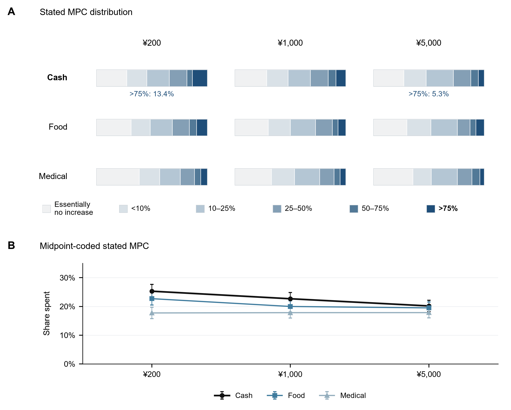
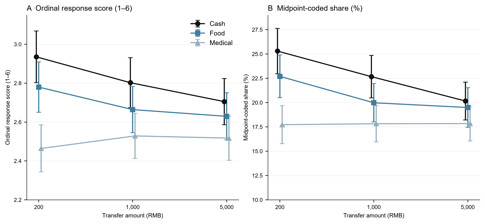
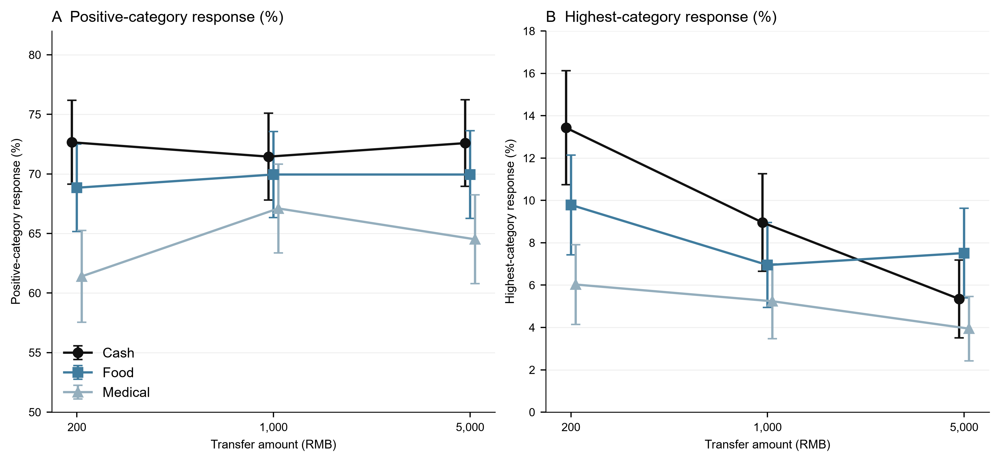

# Transfer size and stated spending: Distributional evidence from cash and earmarked resources

Zelin Liu, Yinghao Pan*

Liu: National School of Development, Peking University (zlliu2026@nsd.pku.edu.cn). Pan: Renmin University of China (panyinghao@ruc.edu.cn). * Corresponding author.

## Abstract

How does the size of a windfall change the distribution of intended spending, and how does that pattern compare across cash and earmarked resources? We study a randomized survey experiment in China assigning 5,480 adults to cash, food vouchers or medical-account credits of RMB 200, 1,000 or 5,000. The midpoint-coded spending share falls from 25.3% to 20.2% for Cash, from 22.7% to 19.5% for Food, and changes little in the observed Medical cells. Cash's highest-response share falls from 13.4% to 5.3%, while the proportion above the essentially-no-spending category remains approximately 72%. A symmetric product decomposition associates almost all of Cash's mean decline with lower conditional-positive spending shares rather than fewer positive responses. This accounting is descriptive because the positive-response group is selected after treatment. Cross-form slope differences remain suggestive under joint multiplicity adjustment, and Medical invariance is not established. The experiment extends work on windfall size and payment representation to category-restricted resources, while distinguishing a clear within-Cash pattern from a less certain interaction. The findings concern hypothetical responses to bundled scenarios, rather than realized consumption or an identified mental-accounting mechanism.

Keywords: stated spending; windfall size; transfer form; mental accounting; survey experiment.

JEL classification: D12; D91; E21; H31.

## 1. Introduction

A small windfall and a large windfall need not generate the same propensity to spend. For a household close to a liquidity constraint, a modest payment may finance purchases that have already been postponed, while a larger payment can leave resources for saving. For another household, a small gain may be easy to ignore whereas a large gain prompts a purchase or a new financial plan. These possibilities make the size dependence of consumption responses economically informative. They also show why a single average marginal propensity to consume cannot summarize every transfer policy. Evidence from income changes, lotteries and hypothetical windfalls documents substantial variation with payment size, household resources and the horizon over which spending is measured (Jappelli and Pistaferri, 2010; Fagereng et al., 2021; Fuster et al., 2021). The relevant question is not only whether the average share falls, but which part of the response distribution changes when it does.

Transfer design introduces a second margin. Resources can arrive as unrestricted money, a voucher for ordinary purchases, or a balance available for a designated use. Differences in permitted expenditure, expiry and liquidity can alter the opportunities to substitute new resources for existing budgets. Labels and accounts can also influence allocation when monetary resources are otherwise substitutable (Abeler and Marklein, 2017; Hastings and Shapiro, 2018). These considerations connect the size of a transfer to the way recipients can use it. A resource that finances existing purchases at a small amount may have different implications when its value approaches a category budget. Conversely, an earmarked account may carry a meaning that changes little across the amounts considered. Understanding the observed size profile therefore requires keeping the form of the resource visible.

We examine these margins in a randomized survey experiment in China. Each respondent receives one of nine hypothetical scenarios formed by crossing three amounts—RMB 200, 1,000 and 5,000—with three transfer forms. Cash is unrestricted. Food is a noncashable voucher for food and daily necessities with a six-month validity period. Medical is a long-lived personal-account credit restricted to medical-related spending. Respondents report additional total spending relative to their previous plans using six ordered percentage categories. The adult sample contains 5,480 respondents. The common question and independent assignment allow comparisons of the stated-response distribution across scenarios. They do not turn the survey into an experiment in actual purchases, and the differences between the forms encompass several attributes rather than a single psychological treatment.

The cells reveal a simple but uneven pattern. The midpoint-coded share for Cash declines from 25.3% at RMB 200 to 22.7% at RMB 1,000 and 20.2% at RMB 5,000. Food declines from 22.7% to 20.0% and 19.5%. Medical is 17.7%, 17.8% and 17.8%. The difference between Cash and the earmarked forms is consequently larger at the smallest amount in these observed means. We use this comparison to frame the empirical question, rather than to assume an interaction is established. In particular, the Medical point estimates do not demonstrate a population response invariant to amount. Its confidence interval permits changes of substantive size, and the formal comparisons of gradients are weaker than the within-Cash evidence.

The distribution provides more information than these means. Among respondents assigned Cash, the probability of selecting the highest category, above 75% of the transfer, falls from 13.4% to 9.0% and 5.3%. By contrast, the share above the essentially-no-spending category is 72.7%, 71.5% and 72.6%. A lower mean response therefore does not primarily reflect a growing mass at the bottom category. Instead, the positive-response distribution contains fewer very high reported shares. Because respondents see only one scenario, this is a comparison of distributions across randomized groups; it does not trace the same people moving between categories. Nor does it show that changes are uniquely concentrated in the upper tail: direct comparisons across thresholds have not established that stronger claim.

We make the relation between these margins explicit through a product decomposition. Coding the lowest category as zero, the unconditional midpoint mean equals the probability of a positive-category answer multiplied by the mean midpoint among those answers. Between the smallest and largest Cash amounts, the unconditional mean falls by 5.14 percentage points. The symmetric decomposition attributes −0.02 points to the participation component and −5.11 points to the conditional-positive component. This is an accounting description of the cells. Conditioning on a response affected by assignment changes the composition of the group, so the latter component is not a causal treatment effect among a fixed set of spenders. The exercise nonetheless makes clear which arithmetic margin accompanies the observed Cash decline.

Prior research is close enough that the contribution must be stated narrowly. Bernard (2023) already randomizes payment mode and shock size and separates extensive and conditional responses. Our contribution is not priority for a joint design or for this margin distinction. It extends the comparison to category-restricted resources, three nominal amounts and explicit uncertainty about differential gradients. Boehm et al. (2025) provide stronger evidence about realized spending under alternative transfer forms, but hold the payment amount fixed. The present experiment asks a complementary question about response distributions across a wider amount range, within an instrument that measures stated additional total spending. It therefore adds a specific comparison rather than overturning existing findings on fungibility or fiscal multipliers.

The analysis separates three empirical claims. First, changing a randomized factor can shift the average response after averaging over the other factor. Medical rather than Cash and a larger rather than smaller amount reduce the highest-category probability. Second, the Cash response decreases with size within that form, both in midpoint-coded shares and in the ordinal score. Third, the amount gradients may differ across forms. The third claim is statistically more demanding and more exposed to outcome selection. Across the existing family of seven outcome codings and three interaction tests for each, the highest-category omnibus test has Holm-adjusted p=0.181 and joint min-P-adjusted p=0.082. These results support treating the cross-form pattern as suggestive rather than presenting it as a generally established interaction.

This distinction also matters for the economic interpretation. A declining finite-windfall share can be consistent with a concave consumption function, liquidity constraints or changes in planning. A large Cash response at small amounts can also be consistent with small-windfall mental accounting. Category restrictions may bind differently as the amount increases. These accounts do not all predict a fixed sign for the difference between Cash and an earmarked form, because substitution, horizons and category budgets matter. We therefore use the existing income-scaling and food-expenditure diagnostics to discipline the discussion. The food-expenditure comparison, in particular, leaves mechanical restrictions as a live explanation. No direct mediator records intended use, perceived spendability or planning horizon, so the evidence does not identify a unique psychological process.

The distributional perspective links the paper to work that distinguishes whether households respond from how much they report spending conditional on a response. Fuster et al. (2021) show that a larger gain can bring more households into the positive-response group even when conditional spending shares fall. Our Cash cells exhibit little movement in the coded participation margin. That difference is informative about the observed instruments, but not a controlled cross-study behavioral contrast. The questions use different filters, horizons and response possibilities. Recent evidence on intertemporal allocation and on heterogeneous size responses likewise cautions against treating a declining average share as a universal property (Andreolli and Surico, 2026; Jappelli et al., 2026). The present decomposition clarifies a particular empirical configuration within this broader range of possibilities.

The paper also relates to behavioral work on payment representation and earmarking. Lee et al. (2024) use hypothetical choices to study mobile money and cash in migrant households, while Pauls and Laudi (2025) examine the temporal framing of a tax cut. Such studies make the representation of resources an economic object in its own right. Our design instead changes packages of use rights and timing alongside amount. This makes the form comparison relevant to transfer programmes, but prevents a clean separation of a label from its associated constraints. A contrast between Food and Cash should accordingly be read as the effect of those complete scenarios on stated answers. It should not be relabelled as a pure mental-accounting effect.

Finally, the measurement boundary shapes what can be learned. The categories preserve broad response ordering, while midpoint coding imposes numerical values within intervals. The lowest category means essentially no increase, not an exact accounting zero. There is no common explicit spending horizon across forms, and the medical balance and voucher have different time rules. Randomization addresses comparisons within this survey; it does not establish national representativeness or transport the estimates to realized expenditure. Parker and Souleles (2019) find supportive correspondence for reports about actual rebates, whereas Ueda (2025) finds no significant relationship between self-reported and transaction-based measures in his setting. We retain the full distributions alongside summary scores so that both the behavioral pattern and its measurement boundary remain visible.

The rest of the paper develops this argument in that order. Section 2 sets out the economic motivation. Section 3 describes the scenarios, sample and measurement. Sections 4 and 5 present the within-form size profiles and their cross-form comparisons. Section 6 locates the Cash decline within the response distribution and gives the decomposition. Section 7 discusses the existing diagnostic evidence, and Sections 8 and 9 draw the bounded implications for transfer design and further evidence. Detailed threshold results, model sensitivity and the analysis history appear in the supplement. This organization keeps the main question centered on the spending response while making the less secure parts of the evidence directly available.

## 2. Related literature and behavioral motivation

The marginal propensity to consume is often used for two different objects: a local response to an extra unit of resources and the share of a finite windfall spent over a specified period. Our outcome is closer to the latter, although it is elicited in bins without a shared horizon. Permanent-income reasoning distinguishes transitory from persistent resources; additional assumptions are needed to predict how a finite-gain share changes with amount (Friedman, 1957). Heterogeneous-agent models make liquidity and the shape of consumption functions central (Kaplan and Violante, 2022). In the data, the size relation can depend on which households receive the payment and which goods and time periods are counted. We accordingly describe a size gradient in stated shares, not a structural derivative.

Mental-accounting models offer a different emphasis. Resources associated with current income, assets or future income may be treated differently, and category budgets can constrain choices even when a fully fungible accounting system would permit substitution (Thaler, 1985, 1999; Shefrin and Thaler, 1988; Heath and Soll, 1996). Evidence on windfalls, denominations and small coupons motivates asking whether some resources feel more immediately spendable (Arkes et al., 1994; Milkman and Beshears, 2009; Raghubir and Srivastava, 2009). This interpretation requires a link from the scenario to the account used by the respondent. A decreasing Cash mean supplies no direct observation of that link.

For restricted resources, substitution is crucial. If a household would already purchase more eligible goods than the transfer covers, a voucher may free cash for other uses. If eligibility binds, the transfer changes the feasible allocation differently from cash. Expiry and access can alter either case. Cash-versus-in-kind experiments and studies of labelled benefits address these margins in different institutional settings (Cunha, 2014; Kooreman, 2000; Beatty et al., 2014; Kan et al., 2017). Consequently, neither a universally widening Cash advantage nor a universally shrinking one follows from the word “restriction.” Category expenditure and total additional expenditure must also remain distinct; a recent transfer-design working paper examines the former (Bonomo et al., 2026).

A final distinction concerns planning. In models with costly reoptimization, the amount can influence whether households adjust and the horizon over which they plan (Boutros, 2026). This can produce different signs across participation and conditional shares. The competing accounts therefore suggest examining levels, slopes and margins separately. They do not provide a sufficiently exclusive prediction to identify one mechanism from our nine cells. The conceptual comparison in Supplementary Table S10 records the assumptions and missing measurements for each account.

## 3. Experimental design, sample and measurement

### 3.1 Scenarios and sample

The questionnaire assigns one hypothetical transfer scenario to each respondent in a 3×3 between-person design. Table 1 gives the adult cell counts and the substantive transfer descriptions. Food refers to food and daily-consumption vouchers that cannot be cashed out and expire after six months. Medical refers to a long-lived personal medical-account credit limited to medical-related expenditure. The question asks how much additional total spending the respondent would make relative to prior plans. It does not ask merely how much of the designated balance would be redeemed.

The dataset contains 5,497 records, including 17 with recorded age below 18. The primary analysis uses the 5,480 adults; the full sample is retained only in historical sensitivity results. Adult cell sizes range from 580 to 634. An existing balance assessment of 41 observed variables in the full sample found no imbalances surviving its false-discovery-rate adjustment. That result is a limited diagnostic rather than proof of allocation integrity. The online sample is not treated as a probability sample, and the primary estimates use no population weights.

### 3.2 Response scales

The six responses are essentially no additional spending, below 10%, 10–25%, 25–50%, 50–75%, and above 75%. The accompanying yuan examples scale with the randomized amount, with the highest example corresponding to 75–100%. Figure 1 retains every category. We report ordinal scores from 1 to 6 as a summary of ordering; equal rank spacing is still a coding assumption, so their means are not invariant to arbitrary monotone recodings. For monetary interpretation, midpoint scores are 0, 0.05, 0.175, 0.375, 0.625 and 0.875. These are proxies for spending shares, not observed values within each interval.

Two threshold outcomes describe the margins emphasized below: an indicator for categories 2–6 and an indicator for the highest category. We call the former a positive-category response, using “any spending” as shorthand only for that coding. The remaining thresholds are retained in the supplement. None of these transformations supplies the common spending horizon missing from the instrument, and none resolves possible anchoring on the amount examples.

### 3.3 Estimation and inference

Cell means are the starting point. For compact size summaries, let z=log(amount/200)/log(5), taking values 0, 1 and 2. We estimate form-specific linear trends and their differences with heteroskedasticity-robust HC3 covariance. The trend is a summary across three randomized amounts, not evidence of a smooth functional law outside them. Separate saturated-cell contrasts average each randomized factor equally over the other factor. Confidence intervals shown in the main figures and effect-size columns are pointwise 95% intervals.

The analysis developed after the data were available. The interaction family contains seven codings and, for each, an omnibus test and two Cash-versus-form slope comparisons. We retain both Holm and joint min-P adjustments across these 21 tests; neither erases the earlier analysis history. The highest-category marginal form and amount comparisons have a separate six-test adjustment, as do the six form contrasts at individual amounts. Other marginal codings are descriptive, and within-form slopes are labelled nominal. These distinct questions should not be combined into a claim that every result controls error across the whole paper. The supplement gives all family definitions, simultaneous intervals, simulations and historical specification results.

## 4. Transfer size and stated spending

Figure 1 shows the complete response distributions, and Figure 2 summarizes the ordinal and midpoint profiles. Cash's midpoint-coded average declines at both amount steps, from 25.30% to 22.67% and 20.16%. Its linear trend is −2.57 percentage points per fivefold increase (95% CI −4.09 to −1.04; nominal p<0.001). The ordinal trend is also negative: −0.115 score units per fivefold increase (−0.205 to −0.026; nominal p=0.011). The agreement indicates that the within-Cash pattern is not merely a consequence of attaching monetary midpoints to the categories. It does not establish invariance to every possible response coding or multiplicity adjustment.

Food has a smaller negative midpoint trend of −1.61 points (−3.10 to −0.11; nominal p=0.035), whereas its ordinal interval includes zero. Medical's midpoint trend is 0.06 points (−1.27 to 1.38). The latter interval allows both a decline and an increase, despite the close observed means. Table 2 places all three trends beside the corresponding cross-form contrasts so that a significant Cash slope cannot be mistaken for evidence that its slope differs from another form.

First-order factor comparisons also matter. Averaging equally over amounts, Medical reduces the highest-category probability relative to Cash by 4.17 points (−5.84 to −2.51; Holm p<0.001). The Food–Cash difference is −1.16 points and less precise after adjustment. Averaging equally over forms, RMB 5,000 rather than RMB 200 reduces that probability by 4.15 points (−5.86 to −2.43; Holm p<0.001). These are effects on a particular stated-response event, not estimates of aggregate consumption multipliers. Full marginal contrasts for the ordinal and midpoint outcomes appear in Supplementary Table S3.

## 5. Comparing the size gradients across forms

The point estimates imply convergence in midpoint-coded means: the Cash–Food gap is about 2.6 points at RMB 200 and 0.7 points at RMB 5,000; the Cash–Medical gap falls from about 7.6 to 2.3 points. The differential trend estimates, however, are imprecise. Cash–Food is −0.96 midpoint-share points per fivefold increase (95% CI −3.10 to 1.17). Cash–Medical is −2.63 points (−4.64 to −0.61). The midpoint omnibus interaction has nominal p=0.033, Holm p=0.522 and joint min-P p=0.232. For ordinal scores the corresponding adjusted values are 0.844 and 0.373. Thus the raw convergence pattern is not a robustly established interaction across the full response summaries.

The highest category gives stronger nominal contrasts. Its decline per fivefold increase is approximately 4.05 points in Cash, 1.14 points in Food and 1.04 points in Medical. The omnibus nominal p=0.009 becomes 0.181 under Holm and 0.082 under joint min-P. Cash–Medical has adjusted p=0.079 and 0.039, respectively, while Cash–Food has 0.224 and 0.105. Both scalar Bonferroni simultaneous intervals across the 21-test family include zero. Reporting the single min-P rejection without the omnibus and alternative adjustment would overstate how securely these data distinguish the curves.

At the largest amount, Food's highest-category share exceeds Cash by 2.17 points (95% CI −0.63 to 4.97; six-contrast Holm p=0.387). The point profiles therefore cross, but the data do not establish a reversal in the population ordering. This distinction is relevant for comparisons with transfer studies finding high expenditure responses to restricted benefits: compatibility with such evidence is not confirmation of a crossover here. Food and Medical remain separate because they differ in both permitted uses and time rules.

## 6. Distributional anatomy of the Cash decline

Figure 3 contrasts the positive-category probability with the highest-category probability. Cash's positive share changes by only −0.07 points between the endpoint amounts, while its conditional-positive midpoint mean falls from 34.82% to 27.78%. The highest response falls by 8.09 points. These facts describe fewer very high shares without a corresponding accumulation in the essentially-no-increase category. The complete bins in Figure 1 guard against reading the two thresholds as a sufficient statistic for all distributional change.

Let p denote the positive-category probability, m+ the mean midpoint within that group, and m the unconditional midpoint mean. Then m=p×m+. For the endpoint change, we use the symmetric identity Δm=Δp×average(m+)+Δm+×average(p). Table 3 reports both contributions for every form. Cash's −5.14-point total is associated with a −0.02-point participation contribution and a −5.11-point conditional-positive contribution. Food's participation contribution is +0.34 points and its conditional component is −3.54 points, yielding −3.20 points overall. Medical combines +0.88 and −0.76 points, leaving a total of +0.12 points. The small Medical net difference therefore does not imply that every distributional margin is unchanged.

The intervals in Table 3 use 4,000 independent cell-stratified bootstrap draws with fixed cell counts. They describe uncertainty in the accounting quantities; no additional component-testing family is introduced. Because selecting positive responses occurs after assignment, this decomposition does not compare a fixed population of spenders under two treatments. “Conditional component” is therefore an arithmetic label, not evidence that the treatment changes spending among the same people. The bounded analysis helps interpret the unconditional effect without introducing that selection error.

The Cash pattern resembles conditional-share compression found elsewhere in the windfall literature. What differs across studies is the importance of entry into a positive response. Our direct bins also treat essentially no increase as zero, while other instruments explicitly ask whether spending changes before eliciting its amount. These measurement differences, together with distinct horizons and populations, prevent a formal cross-study comparison. The decomposition's value is local: it clarifies these cells and provides a precise description that a future study could measure with realized expenditure.

## 7. Interpretation and alternative explanations

### 7.1 Relative amount and planning

Income-relative amount is a plausible alternative representation of scale, but it is not a measured psychological mediator. Existing models compare nominal amount, amount divided by an income-band representation, and unrestricted form-specific amount and income terms. The restriction excluding income is rejected within the seven-test diagnostic family (Holm p=0.030). The ratio restriction has Holm p=0.176, and the direct form×amount×income test has p=1.000 after adjustment. Nonrejection of the ratio restriction is not evidence that it is correct.

Held-out log loss improves by 0.172% for the ratio model relative to nominal amount and by 0.295% for the unrestricted model. These are descriptive predictive differences without a pass/fail materiality threshold. Income contains some information, but neither comparison establishes endogenous earmarking or a planning mechanism. The questionnaire lacks direct measures of how the assigned windfall would be mentally categorized and of the horizon over which it would be spent.

### 7.2 Food expenditure and restrictions

The Food scenario allows substitution against planned eligible purchases. An existing diagnostic classifies adults whose reported monthly food-expenditure lower bound, multiplied by six, exceeds RMB 5,000. Within Cash and Food, the Food–Cash trend difference is 1.33 points in this group and 8.00 points among the remaining respondents. Their direct difference is −6.67 points (95% CI −11.63 to −1.71; nominal p=0.0084; Holm p=0.0504). This result prevents dismissing mechanical restrictions as an explanation of the form comparison.

The classification assumes stable expenditure and comparable eligible purchases during the voucher's validity. Failure to meet it does not prove that a restriction binds, and meeting it does not observe the relevant counterfactual purchases. The diagnostic is consequently suggestive about where the form difference arises, rather than an experiment isolating bindingness. Medical's eligibility and timing are different, so the Food classification should not be extended to Medical by analogy.

### 7.3 Behavioral interpretation

Small-windfall mental accounting offers one coherent reading of a high Cash response at the smallest amount, while category budgets and commitment can help explain responses to earmarked resources. Liquidity and planning accounts can generate overlapping patterns. The existing diagnostics leave these alternatives open. The paper's behavioral content is the observed distributional response to resource scenarios; a psychological explanation remains a hypothesis requiring distinct measurements or manipulations.

## 8. Discussion

The experiment shows why a size comparison benefits from displaying more than an average share. In Cash, the mean decline accompanies a substantial reduction in high responses with little movement in the coded participation rate. In Medical, a small net mean change coexists with offsetting accounting components. These patterns distinguish what the distributions show from a story about how particular households revise their plans. A policy interpretation should respect the same distinction: the findings motivate attention to the amount and form of a transfer, but do not quantify the realized demand generated by a programme.

Three limitations are particularly consequential. First, hypothetical answers are not incentivized consumption decisions. Respondents may use the bins and yuan examples as anchors or apply different implicit horizons. Evidence about survey elicitation shows why format can affect measured size patterns (Crossley et al., 2026); randomized framing also changes other elicited economic responses (Pavlova, 2025). Such measurement effects are not ruled out by our design. Second, Food and Medical bundle use restrictions, liquidity, labels and timing. Their randomized contrasts identify effects of complete scenarios on answers, leaving the contribution of each attribute unresolved. Third, the post hoc analysis history makes the adjusted interaction boundary essential. Neither a new presentation nor a new decomposition supplies independent confirmation.

Sample coverage creates an additional external-validity limit. Age-by-education calibration to the 2020 Chinese census sharply reduces effective sample size; capping weights improves precision at the cost of substantial target-cell discrepancies. This is a sensitivity analysis, not a nationally representative estimate. Pre-scenario response-style screens likewise alter the analyzed population. Highest-category contrasts remain similar in point estimates, but ordinal contrasts attenuate in the strictest screen. Null tests of screen-based effect differences do not establish equivalence, and broad null moderator screens do not demonstrate that household characteristics are irrelevant.

The most useful next evidence would measure the same distributions under real resources and a common horizon while independently varying specific design attributes. Such a study could distinguish whether the observed conditional-share pattern survives actual budget consequences and whether a category label contributes separately from eligibility or expiry. The current evidence provides a bounded empirical comparison to inform that question. It does not justify selecting Cash or a restricted form as the welfare-superior programme, since prices, substitution, timing, administrative costs and recipient welfare are not measured here.

## 9. Conclusion

In a nine-cell randomized survey, Cash's stated spending share declines with amount primarily through the distribution of positive-category answers, rather than through a larger essentially-no-spending group. Food shows a smaller observed decline, and Medical's near-zero mean change combines offsetting margins. Cross-form differences in gradients remain suggestive under joint adjustment. The results extend the description of windfall-size responses to category-restricted resources while preserving the distinction between a distributional fact, an uncertain interaction and an unmeasured mechanism.

## References

Abeler, J., Marklein, F., 2017. Fungibility, Labels, and Consumption. Journal of the European Economic Association, 15, 99-127. https://doi.org/10.1093/jeea/jvw007

Andreolli, M., Surico, P., 2026. ‘Less Is More’: Consumer Spending and the Size of Economic Stimulus Payments. American Economic Journal: Macroeconomics, 18, 34-68. https://doi.org/10.1257/mac.20220169

Arkes, H.R., Joyner, C.A., Pezzo, M.V., Nash, J.G., Siegel-Jacobs, K., Stone, E., 1994. The Psychology of Windfall Gains. Organizational Behavior and Human Decision Processes, 59, 331-347. https://doi.org/10.1006/obhd.1994.1063

Beatty, T.K., Blow, L., Crossley, T.F., O'Dea, C., 2014. Cash by any other name? Evidence on labeling from the UK Winter Fuel Payment. Journal of Public Economics, 118, 86-96. https://doi.org/10.1016/j.jpubeco.2014.06.007

Bernard, R., 2023. Mental Accounting and the Marginal Propensity to Consume. Deutsche Bundesbank Discussion Paper 13/2023. https://www.bundesbank.de/en/publications/research/discussion-papers/mental-accounting-and-the-marginal-propensity-to-consume-909438

Boehm, J., Fize, E., Jaravel, X., 2025. Five Facts about MPCs: Evidence from a Randomized Experiment. American Economic Review, 115, 1-42. https://doi.org/10.1257/aer.20240138

Bonomo, T., Ruffini, K., Schanzenbach, D.W., 2026. Is a Dollar a Dollar? How Transfer Design Shapes Household Spending. National Bureau of Economic Research. https://doi.org/10.3386/w35698

Boutros, M., 2026. Windfall income shocks with finite planning horizons. Journal of Financial Economics, 176, 104174. https://doi.org/10.1016/j.jfineco.2025.104174

Crossley, T.F., Fisher, P., Levell, P., Low, H., 2026. Eliciting the marginal propensity to consume in surveys. Federal Reserve Bank of Chicago Working Paper 2026-04. https://www.chicagofed.org/publications/working-papers/2026/2026-04

Cunha, J.M., 2014. Testing Paternalism: Cash versus In-Kind Transfers. American Economic Journal: Applied Economics, 6, 195-230. https://doi.org/10.1257/app.6.2.195

Fagereng, A., Holm, M.B., Natvik, G.J., 2021. MPC Heterogeneity and Household Balance Sheets. American Economic Journal: Macroeconomics, 13, 1-54. https://doi.org/10.1257/mac.20190211

Friedman, M., 1957. The Permanent Income Hypothesis. In A Theory of the Consumption Function, pp.20–37. Princeton University Press. https://www.nber.org/books-and-chapters/theory-consumption-function/permanent-income-hypothesis

Fuster, A., Kaplan, G., Zafar, B., 2021. What Would You Do with $500? Spending Responses to Gains, Losses, News, and Loans. The Review of Economic Studies, 88, 1760-1795. https://doi.org/10.1093/restud/rdaa076

Hastings, J., Shapiro, J.M., 2018. How Are SNAP Benefits Spent? Evidence from a Retail Panel. American Economic Review, 108, 3493-3540. https://doi.org/10.1257/aer.20170866

Heath, C., Soll, J.B., 1996. Mental Budgeting and Consumer Decisions. Journal of Consumer Research, 23, 40-52. https://doi.org/10.1086/209465

Jappelli, T., Pistaferri, L., 2010. The Consumption Response to Income Changes. Annual Review of Economics, 2, 479-506. https://doi.org/10.1146/annurev.economics.050708.142933

Jappelli, T., Savoia, E., Sciacchetano, A., 2026. Intertemporal MPC and shock size. European Economic Review, 186, 105303. https://doi.org/10.1016/j.euroecorev.2026.105303

Kan, K., Peng, S., Wang, P., 2017. Understanding Consumption Behavior: Evidence from Consumers' Reaction to Shopping Vouchers. American Economic Journal: Economic Policy, 9, 137-153. https://doi.org/10.1257/pol.20130426

Kaplan, G., Violante, G.L., 2022. The Marginal Propensity to Consume in Heterogeneous Agent Models. Annual Review of Economics, 14, 747-775. https://doi.org/10.1146/annurev-economics-080217-053444

Kooreman, P., 2000. The Labeling Effect of a Child Benefit System. American Economic Review, 90, 571-583. https://doi.org/10.1257/aer.90.3.571

Lee, J.N., Morduch, J., Ravindran, S., Shonchoy, A.S., 2024. The social meaning of mobile money: Earmarking reduces the willingness to spend in migrant households. Journal of Economic Behavior & Organization, 221, 675-688. https://doi.org/10.1016/j.jebo.2024.04.023

Milkman, K.L., Beshears, J., 2009. Mental accounting and small windfalls: Evidence from an online grocer. Journal of Economic Behavior & Organization, 71, 384-394. https://doi.org/10.1016/j.jebo.2009.04.007

Parker, J.A., Souleles, N.S., 2019. Reported Effects versus Revealed-Preference Estimates: Evidence from the Propensity to Spend Tax Rebates. American Economic Review: Insights, 1, 273-290. https://doi.org/10.1257/aeri.20180333

Pauls, T., Laudi, M., 2025. Temporal framing of tax stimuli and household consumption. Journal of Economic Behavior & Organization, 235, 107079. https://doi.org/10.1016/j.jebo.2025.107079

Pavlova, L., 2025. Framing effects in consumer expectations surveys. Journal of Economic Behavior & Organization, 231, 106899. https://doi.org/10.1016/j.jebo.2025.106899

Raghubir, P., Srivastava, J., 2009. The Denomination Effect. Journal of Consumer Research, 36, 701-713. https://doi.org/10.1086/599222

Shefrin, H.M., Thaler, R.H., 1988. The behavioral life-cycle hypothesis. Economic Inquiry, 26, 609-643. https://doi.org/10.1111/j.1465-7295.1988.tb01520.x

Thaler, R., 1985. Mental Accounting and Consumer Choice. Marketing Science, 4, 199-214. https://doi.org/10.1287/mksc.4.3.199

Thaler, R.H., 1999. Mental accounting matters. Journal of Behavioral Decision Making, 12, 183-206. https://doi.org/10.1002/(sici)1099-0771(199909)12:3<183::aid-bdm318>3.0.co;2-f

Ueda, K., 2025. The reality of consumption: Comparing self-reported and observed marginal propensity to consume. Economics Letters, 247, 112179. https://doi.org/10.1016/j.econlet.2025.112179

## Tables and figures

### Table 1. Randomized scenarios and adult cell sizes

| Form and use rights | RMB 200 | RMB 1,000 | RMB 5,000 |
| --- | --- | --- | --- |
| Cash: unrestricted | 618 | 592 | 580 |
| Food: noncashable food/daily-necessities vouchers; six-month expiry | 613 | 619 | 599 |
| Medical: medical-related personal-account credit; long-lived | 614 | 611 | 634 |

N=5,480 adults. Each respondent sees one scenario. Form bundles permitted use, liquidity, label, timing and wording. The outcome concerns additional total spending, not only eligible purchases.

### Table 2. Within-form trends and Cash-versus-form slope differences

| Outcome | Trend / contrast | Estimate [95% CI] | Nominal p | Holm 21 |
| --- | --- | --- | --- | --- |
| Ordinal | Cash | -0.115 [-0.205, -0.026] | 0.011 | — |
| Ordinal | Food | -0.075 [-0.164, 0.013] | 0.096 | — |
| Ordinal | Medical | 0.026 [-0.057, 0.109] | 0.533 | — |
| Ordinal | Cash-Food | -0.040 [-0.166, 0.086] | 0.534 | 1.000 |
| Ordinal | Cash-Medical | -0.142 [-0.264, -0.020] | 0.023 | 0.387 |
| Midpoint | Cash | -2.57 [-4.09, -1.04] | <0.001 | — |
| Midpoint | Food | -1.61 [-3.10, -0.11] | 0.035 | — |
| Midpoint | Medical | 0.06 [-1.27, 1.38] | 0.932 | — |
| Midpoint | Cash-Food | -0.96 [-3.10, 1.17] | 0.378 | 1.000 |
| Midpoint | Cash-Medical | -2.63 [-4.64, -0.61] | 0.011 | 0.204 |
| >75% | Cash | -4.05 [-5.68, -2.41] | <0.001 | — |
| >75% | Food | -1.14 [-2.73, 0.44] | 0.157 | — |
| >75% | Medical | -1.04 [-2.25, 0.17] | 0.091 | — |
| >75% | Cash-Food | -2.90 [-5.18, -0.63] | 0.012 | 0.224 |
| >75% | Cash-Medical | -3.00 [-5.04, -0.97] | 0.004 | 0.079 |

Per fivefold amount increase. Ordinal units are score points; midpoint and highest-category (>75%) units are percentage points. Intervals are pointwise HC3. Within-form p values are nominal, not members of the 21-test interaction family. Omnibus Holm/min-P values: ordinal 0.844/0.373, midpoint 0.522/0.232, highest category 0.181/0.082. Highest-category Cash–Food and Cash–Medical min-P values are 0.105 and 0.039. All 21 results and simultaneous intervals are in Table S5 and the source CSV.

### Table 3. Descriptive decomposition of the RMB 200-to-5,000 change

| Form | Participation component | Conditional-positive component | Total midpoint change |
| --- | --- | --- | --- |
| Cash | -0.02 [-1.66, 1.60] | -5.11 [-7.59, -2.56] | -5.14 [-8.01, -2.17] |
| Food | 0.34 [-1.15, 1.93] | -3.54 [-6.16, -0.90] | -3.20 [-6.26, -0.15] |
| Medical | 0.88 [-0.64, 2.36] | -0.76 [-2.92, 1.36] | 0.12 [-2.53, 2.78] |

Percentage points, with pointwise 95% cell-stratified bootstrap percentile intervals (4,000 draws, seed 2026100316). Components sum to the total before rounding. Positive-group membership is post-treatment; the conditional component is not a causal intensive-margin effect. No component-significance selection is used.

Figure 1. Response distributions and midpoint means. A: six unconditional response categories in each adult cell, shaded from light to dark in spending order. B: midpoint-coded shares and pointwise 95% normal intervals from cell variances. Cash/Food/Medical cell Ns at 200/1,000/5,000 are 618/592/580,613/619/599 and 614/611/634. The lowest category means essentially no increase. Lines join independent randomized groups at three discrete amounts, not within-person paths. All panels use adults (N=5,480).

Figure 2. Form-specific size profiles. A: mean ordinal score (1–6); B: midpoint-coded spending share. Error bars are pointwise 95% normal intervals, not simultaneous interaction intervals. Adult cells and Ns are as in Figure 1. Lines connect three independent groups. Equal ordinal spacing and within-bin midpoint values are separate coding assumptions; similar Medical means do not establish invariance.

Figure 3. Participation and high-response margins. A: probability of choosing a category above essentially no increase; B: probability of the above 75% category. Adult sample and cell Ns are as in Figure 1. Error bars are pointwise 95% normal intervals. The Cash upper response falls while its positive-category frequency is similar at the endpoints. These are between-group distributions; no claim of exclusively tail-specific change or a fixed set of responders is implied.
