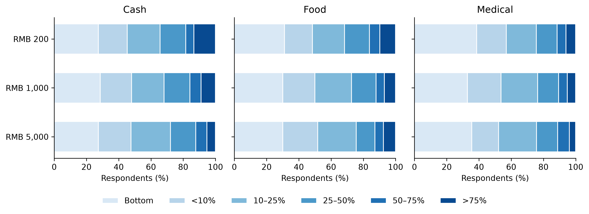
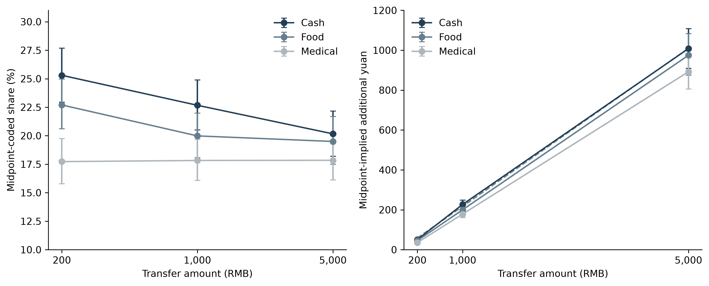
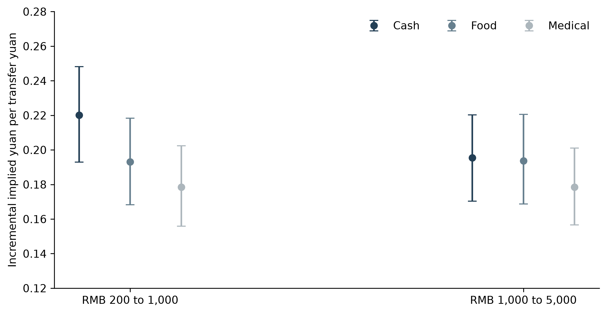
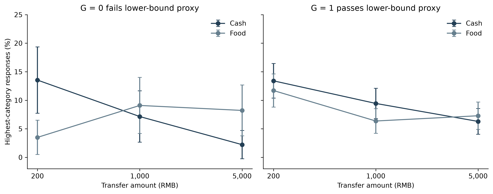

# Transfer size and form in stated spending responses

Author details to be supplied separately before submission.

## Abstract

A decline in the spending share of a larger transfer need not imply a weak response in yuan. We examine both scales in a randomized survey experiment assigning 5,480 adults in China to hypothetical Cash, Food-voucher or Medical-account transfers of RMB 200, 1,000 or 5,000. The Cash midpoint-coded spending share falls from 25.3% to 20.2%, while implied additional yuan grows from 51 to 1,008. Its incremental implied response is 0.220 over the first amount interval and 0.195 over the second, compared with approximately 0.193 for Food and 0.179 for Medical. A descriptive affine model accommodates the nine midpoint means, but neither equal form slopes nor an intercept-only explanation is established. Censored-normal sensitivities depend strongly on residual-scale assumptions. In a 42-test family spanning seven response codings and six trend tests, Cash midpoint and highest-category trends retain evidence, whereas the ordinal trend and cross-form interaction do not. A food-expenditure subgroup pattern has the opposite sign to a sharp increasing-bindingness prediction, and continuous moderation remains imprecise. The experiment distinguishes observed response distributions, coded scales and mechanism predictions; it does not identify a psychological mediator or realized consumption effects.

Keywords: transfer size; earmarking; stated spending; marginal propensity to consume; survey experiment

JEL classification: D12; D14; D91; E21

## 1 Introduction

Transfers differ in what recipients can do with them and in how large they are. A small cash payment, a voucher for groceries and daily necessities, and a balance in a medical account enter the household budget with different rights and cues. These differences may matter for reported spending, but an apparent size effect also depends on the scale on which spending is expressed. A fall in the fraction of a transfer allocated to consumption can accompany a substantial, almost proportional increase in additional yuan. Understanding this distinction is necessary before assigning a behavioral explanation to a declining spending-share curve.

We study a randomized survey experiment in China that crosses three resource bundles with three nominal amounts. Each respondent sees one hypothetical Cash, Food or Medical scenario worth RMB 200, 1,000 or 5,000 and reports how much total consumption would exceed their original plan. The response uses six ordered categories with percentage labels and yuan examples. Among 5,480 adults, the Cash midpoint-coded share falls from 25.3% to 20.2% between the endpoint amounts. Yet its implied additional spending rises from RMB 51 to RMB 1,008. The relevant empirical question is whether differences across forms mainly concern levels at smaller amounts, incremental yuan responses, or both.

The scale comparison sharpens the description. Cash has an incremental midpoint-implied yuan response of 0.220 from RMB 200 to 1,000 and 0.195 from RMB 1,000 to 5,000. Food is approximately 0.193 in both intervals, and Medical approximately 0.179. High-interval Cash–Food point estimates are especially close, but their confidence interval permits meaningful differences in either direction. A form-specific affine model describes the midpoint means well. Its fitted intercepts and slopes are uncertain, and an interval-censored sensitivity changes substantially when the residual scale can vary with amount. We therefore report the affine function as a descriptive benchmark rather than as a structural consumption function.

Evidence about trends must also account for the choice of outcome. Across a family of 42 tests, the Cash midpoint and highest-category trends remain detectable; the Cash ordinal trend does not. Cross-form slope differences are not robust to the expanded correction. This distinction permits a clear within-Cash coded pattern without elevating the more demanding form-by-size interaction into an established result. The highest-category Food frequency exceeds Cash at RMB 5,000, but that crossing is itself imprecise. It cannot establish that a restricted transfer induces more total spending.

Our contribution is a bounded extension of related designs. Bernard (2023) already randomizes payment mode and shock size, using cash, an instant-access savings account and an unspecified mode. We add category-restricted Food and Medical bundles across three nominal amounts and compare the observed distribution with share and implied-yuan descriptions. There is no claim of the first joint design or of a new extensive-margin result. Boehm et al. (2025) provide stronger evidence from actual transfers and transactions, holding the transfer amount fixed. Our instrument addresses a complementary stated-response comparison and cannot substitute for that realized-spending evidence.

The paper also separates mechanism predictions from their precision. A sharp version of increasing Food bindingness predicts a more negative Food–Cash size gradient where a restriction is more likely to bind. The historical subgroup estimate is positive, contradicting that prediction conditional on an imperfect expenditure proxy. Continuous food-expenditure moderation has a wide confidence interval, and income, liquidity and response-style diagnostics do not exclude economically meaningful moderation. These findings constrain specific interpretations while leaving the underlying behavioral process unresolved.

Section 2 places the comparison in the literature. Section 3 describes the design and estimands. Section 4 reports distributions, scales and multiplicity. Section 5 evaluates Food predictions and the precision of other diagnostics. Section 6 discusses the scope of the evidence.

## 2 Transfer size form and measurement

### 2.1 Spending shares and finite increments

For an amount T, a reported finite-windfall share S summarizes an allocation of the whole transfer. Multiplying a coded share by T gives an implied yuan amount Y. Neither object is automatically the local derivative of consumption with respect to income. The finite increment between two amounts is the difference in mean implied yuan divided by the difference in transfer amount. It uses a different denominator from either endpoint share and is identified here from different respondents assigned to the two scenarios.

An affine description, Y = a + bT within a form, implies a share a/T + b. A positive fitted intercept can therefore accompany a declining share with relatively stable incremental yuan responses. This is a useful benchmark, not a theory of how a household treats a zero transfer: zero lies outside the design. Differences in fitted intercepts or slopes can reflect coding, heterogeneous responses and the bundled scenarios as well as preferences or constraints.

Size responses need not be universally decreasing. Fuster et al. (2021) find that larger hypothetical gains increase reported responses through the extensive margin of adjustment in their elicitation design. Andreolli and Surico (2026) report higher responses to large gains among affluent households and higher responses to small gains among liquidity-poor households. Their findings motivate attention to resource heterogeneity and question design; they do not supply a monotonicity condition that all populations or instruments must satisfy.

### 2.2 Resource bundles and the JEBO comparison

Mental accounting permits budgets and labels to affect allocation (Thaler, 1985, 1999; Shefrin and Thaler, 1988). Labeling evidence also shows that a benefit's purpose can influence expenditure even when it is not a fully binding restriction (Kooreman, 2000; Abeler and Marklein, 2017). Evidence on SNAP demonstrates that eligible spending can respond differently from unrestricted resources, but category expenditure and total additional consumption are distinct outcomes (Hastings and Shapiro, 2018).

Bonomo et al. (2026), a working paper, compare actual transfer programmes using food-store scanner data. They find stronger short-run food-store responses to in-kind than cash benefits and to recurring than one-time payments. This supports considering both form and timing, but it does not predict our total-consumption categories or validate their hypothetical measurement. Boehm et al. (2025) separately show that a cash-like transfer and a rapidly expiring card can produce different realized consumption responses. Our Food scenario also bundles an eligible-use restriction with expiry; Medical bundles a different eligible category with an accumulating account. These contrasts cannot isolate a pure label effect.

Two JEBO studies clarify the paper's behavioral location. Lee et al. (2024) study willingness to spend with mobile money in migrant households, emphasizing the social meaning of a payment instrument. Pauls and Laudi (2025) study temporal framing of a permanent tax cut among bank clients; the representation of the same income flow changes its reported allocation. Our comparison concerns nominal amounts and resource bundles rather than willingness to pay or the framing of a recurring tax cut. Its useful contribution is a transparent comparison of those stated distributions, not identification of the same mechanism in a new setting.

### 2.3 The elicitation boundary

The response is a direct binned question about hypothetical additional total consumption. Shapiro and Slemrod (2003) and Parker and Souleles (2019) concern reports about actual tax rebates. The latter links reported effects to revealed spending estimates in that setting; it does not validate all hypothetical instruments. Ueda (2025) provides a further caution about correspondence between self-reported and observed responses. Crossley et al. (2026), a working paper, show that direct and filtered questions change the response distribution and its relationship with payment size, horizon and liquidity. Elicitation format is thus part of the interpretation, not a minor measurement detail.

Our lowest category says essentially no additional consumption rather than recording an exact zero. Above-bottom-category probability is consequently not an observed spending-participation probability. Its yuan meaning may also change with transfer size because the neighboring label is below approximately 10% of T. Comparing this arithmetic component with another study's filtered extensive margin cannot establish an opposite behavioral response.

## 3 Design data and estimands

### 3.1 Scenarios and analysis sample

The integrated questionnaire states that the system randomly selects one of nine versions, and each respondent answers only that version. In the delivered data, exactly one of the nine scenario columns is populated per respondent. Cash is a one-time unrestricted payment into a bank account or WeChat/Alipay, available for spending, saving or debt repayment. Food is an electronic voucher restricted to food and daily necessities, valid for six months and noncashable. Medical is a credit to a medical-insurance personal account, usable for the respondent's and family's medical expenses, with long-term validity and accumulating balances. All versions ask about total consumption above the original plan. There is no shared explicit spending horizon across forms. The treatment is assignment to these complete descriptions, rather than to a single economic restriction.

The delivered dataset contains 5,497 responses, including 17 with recorded age below 18. The analysis uses the 5,480 respondents aged 18–100. Table 1 reports the cell counts. Mean recorded age is 33.3 years; 53.0% are women, and 49.2% report a bachelor's degree. Background fields used in the eight-variable balance audit have no missing values in the adult sample. Supplementary tables retain category labels, the 30 observations with a legacy income-band scheme, and city-tier information. City tier does not establish province coverage or national representativeness. None of the eight baseline balance tests rejects after Holm correction; sparse income cells limit the chi-square diagnostic. Balance nonrejection is not proof of correct randomization.

The hosting platform is identified in the available project documentation as Tencent Questionnaire. Recruitment vendor and sampling frame, field dates, survey compensation, invitation/start/completion counts, allocation implementation and formal ethics/consent records have not been verified from the available sources. These items require author documentation before submission. The original integrated questionnaire and data establish scenario wording and delivered counts; they do not establish those collection facts. Excluding recorded minors does not resolve the ethics of their original participation. No claim of an approved or exempt protocol is made here without the corresponding record.

### 3.2 Outcomes and inference

The original categories are essentially no additional consumption; approximately below 10%; 10–25%; 25–50%; 50–75%; and above 75%, each accompanied by yuan examples. The top example ends at the transfer amount even though the verbal threshold is open. We report all six frequencies, the ordinal score 1–6, midpoint codes 0, 0.05, 0.175, 0.375, 0.625 and 0.875, above-bottom-category probability, and the four higher category thresholds. These are seven representations of one answer, not seven independent behavioral measurements. Midpoint-implied yuan is T times the midpoint code and is not observed expenditure.

Trend models regress each representation on form indicators and a log-fivefold amount step, with all form interactions. One step moves from 200 to 1,000 or from 1,000 to 5,000; the linear trend summarizes both intervals. HC3 covariance uses respondent-level outcome dispersion. The 42-test sensitivity includes, for each of seven codings, three within-form trends, a two-degree-of-freedom interaction test, and Cash–Food and Cash–Medical slope contrasts. We report nominal p values, Holm42 and joint Gaussian centered-error min-P42. Scalar tests are converted to normal p values and omnibus statistics to their appropriate chi-square p values before taking the minimum. Joint dependence across outcomes is retained. Min-P uses 10,000 fixed-seed draws and is asymptotic inference, not an exact randomization test. Conservative simultaneous scalar intervals use Bonferroni42. Separate, explicitly identified families apply to the six pairwise incremental-yuan contrasts, three nested affine comparisons, six food-band moderator tests and six ratio restrictions.

The study was not preregistered. Reviewer-stage analyses were fixed after earlier results from the same dataset were known and before these new calculations. Their freezing restricts further analytic flexibility; it does not give them retrospective confirmatory status. Earlier families and response-style sensitivities remain disclosed in the supplement. AI-assisted tools supported drafting and preparation of analysis scripts; estimates were computed by deterministic statistical software and checked against independent respondent-level calculations and aggregate identities. Human author review remains required.

### 3.3 Yuan affine and interval descriptions

We estimate finite incremental implied-yuan responses and endpoint log elasticities from the nine adult cell means. Cell-stratified respondent-equivalent bootstrap intervals use 4,000 draws. The same draws support the affine midpoint regression and its parameter intervals. We compare a common intercept and slope, form intercepts with a common slope, and form intercepts and slopes, reporting HC3 Wald comparisons and lack of fit against saturated cell means.

The interval sensitivity does not invent a numerical boundary between the first two categories. It merges them below 10% conditional on interpreting essentially no increase as below that threshold, retains the three interior intervals, and right-censors above 75%. This mapping imposes an interpretation of approximate wording; it is not coding-free identification. A normal latent-yuan affine model uses a common constant residual scale, with one alternative allowing separate residual scales at the three amounts. Both permit a negative latent lower tail and have no nonnegative structural spending interpretation. Each unrestricted model uses 4,000 bootstrap draws; constrained common-slope fits and all cell-by-category calibration discrepancies are also reported. Calibration, rather than convergence alone, determines whether the model offers a useful summary.

## 4 Distributions shares and implied yuan

### 4.1 Raw responses and first-order contrasts

Figure 1 displays the adult response atlas. The Cash midpoint means at RMB 200, 1,000 and 5,000 are 25.30%, 22.67% and 20.16%; Food means are 22.70%, 19.98% and 19.49%; Medical means are 17.73%, 17.83% and 17.84%. Cash highest-category frequencies decline from 13.43% to 8.95% and 5.34%. Food frequencies are 9.79%, 6.95% and 7.51%, and Medical frequencies 6.03%, 5.24% and 3.94%. The six-bin atlas shows where each mean and threshold result comes from rather than letting the highest category stand in for the entire distribution.

Factorial main effects average equally over the other randomized factor. In the historical adult six-test highest-category family, Medical–Cash is −4.17 percentage points (95% CI −5.84 to −2.51; Holm p<0.001), and Food–Cash is −1.16 points (−2.99 to 0.66; Holm p=0.213). Averaging equally over forms, RMB 5,000 rather than RMB 200 lowers the highest-category frequency by 4.15 points (−5.86 to −2.43; Holm p<0.001). These averaging contrasts answer different questions from unequal size gradients and retain their original disclosed family.

At RMB 5,000, Food exceeds Cash in the highest category by 2.17 points (95% CI −0.63 to 4.97; Holm6 p=0.387 across the historical six amount-specific contrasts). The sign is compatible with a reversal of the small-amount ordering, but the crossing is not precisely established. Lower endpoint frequencies can affect comparisons of absolute probability changes; historical odds-scale checks preserve a larger Cash decline and do not make the form interaction conclusive. Neither a visual crossing nor an overlapping interval establishes equal overall distributions.

### 4.2 The yuan re-expression

Figure 2 displays share and implied-yuan scales together. Cash implied yuan is 50.60, 226.69 and 1,008.19; Food is 45.40, 199.84 and 974.75; Medical is 35.46, 178.27 and 892.15. Multiplication by the assigned amount is arithmetic. The informative comparisons are the incremental responses and their uncertainty, not the observation that a much larger payment implies more yuan.

Table 2 and Figure 3 show those increments. Cash's low-interval estimate is 0.220 [0.193, 0.248], falling descriptively to 0.195 [0.170, 0.220] in the high interval. Food's estimates are 0.193 [0.168, 0.218] and 0.194 [0.169, 0.221]; Medical's are 0.179 [0.156, 0.202] and 0.178 [0.157, 0.201]. The high-interval Cash–Food difference is 0.0016 [−0.0349, 0.0365], and Cash–Medical is 0.0169 [−0.0176, 0.0510]. None of the six pairwise interval contrasts retains Holm6 significance. Similar point estimates describe the cells, while these intervals preclude an equivalence claim. We have no independent economically justified equivalence margin.

Endpoint elasticities are 0.930 [0.887, 0.971] for Cash, 0.953 [0.908, 0.996] for Food, and 1.002 [0.955, 1.046] for Medical. These are descriptive log changes in midpoint-implied yuan between the endpoint amounts. They distinguish a falling finite-transfer share from a nearly proportional yuan response without identifying a derivative or a psychological shift. Form differences in percentage shares are larger at the smallest amount, but absolute implied-yuan gaps need not shrink: Cash–Medical is about RMB 15 at 200 and RMB 116 at 5,000. A claim that all form differences are confined to small transfers would be incorrect.

### 4.3 How useful is the affine benchmark

Table 3 reports the form-specific affine estimates. Midpoint slopes are 0.198 for Cash, 0.194 for Food and 0.178 for Medical. Cash–Food is 0.0046 with bootstrap CI [−0.0273, 0.0348], and Cash–Medical is 0.0197 [−0.0099, 0.0499]. The robust slope-equality test has p=0.381. A common slope is a parsimonious description compatible with these intervals, not a demonstrated equality.

The common-intercept/common-slope model has weighted cell RMSE RMB 30.76 and rejects saturated-cell fit. Allowing form intercepts reduces RMSE to 18.28 (lack-of-fit p=0.178); allowing form slopes as well reduces it to 4.17 (p=0.710). Jointly imposing common intercept and slope is rejected after Holm3 (p=0.000423). The separate intercept restriction has Holm3 p=0.061, and the slope restriction Holm3 p=0.381. These results favor allowing form differences somewhere in the affine description but do not establish that they are exclusively intercept differences. In the unrestricted midpoint model, the fitted Cash intercept is RMB 18.7 [2.7, 35.3], Food 6.4 [−10.1, 22.5], and Medical −0.2 [−14.5, 14.5]. Their interpretation is limited by extrapolation beyond the observed amounts.

The interval sensitivities limit any stronger conclusion. With a constant residual scale, the model converges but misses an individual merged-category probability by as much as 20.81 percentage points. Allowing the scale to vary with amount lowers that maximum discrepancy to 8.78 points but changes the latent slopes from roughly 0.23–0.24 to 0.05–0.10 (Table 3). Slope-equality p values are 0.780 and 0.077, respectively. These are assumption-dependent diagnostic tests. All 8,000 bootstrap fits converge; that numerical result cannot rescue poor calibration or turn latent parameters into realized MPCs. The midpoint scale findings remain useful descriptions of the coded answers, but the interval analysis does not establish coding-robust structural slopes.

### 4.4 Trend inference and the bottom-category decomposition

Table 4 presents the enlarged multiplicity family. The Cash midpoint trend is −2.57 percentage points per fivefold amount step (nominal p=0.000956; Holm42 p=0.0392; min-P42 p=0.0199). The Cash highest-category trend is −4.05 points (Holm42 p=0.000051; min-P42 p=0.000100, the simulation resolution). The ordinal trend is −0.115 categories (nominal p=0.0114), but Holm42 p=0.400 and min-P42 p=0.182. We retain that loss of evidence rather than using its nominal interval as a robustness certificate.

The highest-category cross-form omnibus has nominal p=0.0090, Holm42 p=0.334 and min-P42 p=0.149. Cash–Food and Cash–Medical gradients have Holm42 p=0.422 and 0.147, and min-P42 p=0.192 and 0.0686. Their Bonferroni42 intervals include zero. The observed steeper Cash tail decline remains suggestive across forms, even though the within-Cash coded trend survives correction. The original 21-test family and the expanded 42-test sensitivity are both reported in the supplement, with no claim that either was selected before data collection.

For the midpoint outcome, the mean equals above-bottom-category probability times its conditional-above-bottom mean because the bottom code is zero. A symmetric product decomposition attributes the endpoint Cash change of −5.14 points to a bottom-category component of −0.02 points and a conditional-above-bottom component of −5.11 points. Food components are +0.34 and −3.54 points, and Medical +0.88 and −0.76 points. This is a coding identity. It neither measures exact spending participation nor identifies a causal response among a fixed subgroup, since category selection is affected by assignment. The lowest verbal label and its neighboring percentage threshold also need not represent a common yuan cutoff at different amounts. The decomposition therefore cannot establish a Fuster-style extensive/intensive contrast.

## 5 Predictions and precision

### 5.1 Food expenditure and the sign of bindingness

A sharp simple increasing-bindingness account predicts a more negative Food–Cash size gradient among households for whom a larger voucher is harder to absorb. Let G=1 indicate that six times the lower bound of a respondent's monthly food-expenditure band exceeds RMB 5,000. G=0 fails that proxy condition; it is not observed bindingness. This six-month comparison borrows the Food expiry period and does not supply a common consumption horizon or counterfactual redemption measure. Baseline food alone also omits the daily necessities eligible under the voucher.

Figure 4 plots the raw adult Cash/Food cells within these two groups. Food–Cash highest-category gradients are +8.00 points per fivefold step in G=0 (95% CI 3.83 to 12.18; N=815) and +1.33 points in G=1 (−1.35 to 4.01; N=2,806). G=1 minus G=0 is −6.67 points (−11.63 to −1.71; historical Holm7 p=0.0504). The positive gradient in G=0 is opposite to the sharp negative prediction. It must not be described as exactly predicted or as affirmative evidence that simple increasing bindingness explains the Cash–Food pattern. Imperfect classification, substitution and other restrictions remain possible; this contradiction does not reject every model with binding constraints.

We next use the ordered monthly food band as the frozen continuous moderator, standardized within the 3,621 adult Cash/Food respondents. The highest-category Food–Cash size-gradient moderation is +0.29 points per standard deviation (95% CI −2.33 to 2.91). Adjustment for log mapped income and ordered household size gives +0.44 points (−2.29 to 3.17). The midpoint and ordinal coefficients are also imprecise. All six focal unadjusted/adjusted tests have Holm6 p=1.000. Household size is top-coded at six or more, and income is band mapped, so adjustment does not fully measure household needs or resources.

The ratio-only sensitivity imposes two restrictions: both the common and form-dependent log-amount coefficients must be the negatives of their log expenditure coefficients. Testing only the interaction restriction is insufficient to test that entire model. Under the two frozen food-band mappings, the full restriction has highest-category Holm6 p=0.0426 and 0.0437; corresponding midpoint and ordinal restrictions are rejected more strongly. The historical one-degree-of-freedom nonrejection therefore cannot support a complete ratio-only account. These proxy-based fits do not reject all expenditure-normalized behavior, but they provide no affirmative evidence that a single transfer-to-food ratio organizes the responses.

### 5.2 What the remaining diagnostics can distinguish

The nominal 80% minimum detectable moderation for the unadjusted highest-category food-band test is 3.75 percentage points per standard deviation; a conservative six-test adjustment raises it to 4.65 points. Across the observed 10th–90th food-band span, its pointwise confidence interval permits a change in the Food–Cash size gradient from −6.00 to +7.49 points per fivefold step. Those possibilities are large relative to the adult Cash highest-category slope of −4.05 points. The interval is a range of compatible observational moderation, not a causal fraction of the pattern explained. Nonrejection provides little basis for excluding a category-need mechanism.

Historical income diagnostics reject a pure nominal-only restriction within their original family, while a pure relative-income restriction and income three-way interaction do not retain corrected evidence. Relative scaling improves held-out highest-category prediction by only about 0.12%–0.17% under the two mappings. These small fixed-fold prediction gains do not establish substantive superiority. A predictor comparison and a nonrejected coefficient restriction are different criteria. Neither establishes relative-scale sufficiency nor excludes income-related behavior. The full prediction-and-precision ledger preserves their exact estimands and identifies joint tests for which no unique scalar MDE exists.

Emergency fundraising capacity, income rank and baseline category needs are observational associations, not positive controls validating the survey. Cash amount is itself the studied factor and cannot serve as an independent positive control. The historical income association has the opposite sign to the generic validation prediction, and the emergency-capacity association is marginal after its original correction. These patterns do not imply a failed instrument or a universal mechanism; they show why validation language was too strong. Historical moderator confidence intervals permit substantial changes, and broad observable-screen nonrejections do not establish population homogeneity. The earlier full-delivery associations are clearly separated from the new adult estimates in the supplement.

Q1 and Q2 are response-style screens based on variation across 15 attitude items numbered before the scenario. They are not validated attention checks. The integrated instrument supports treating their component answers as pre-scenario measurements, subject to confirmation of the deployed survey sequence; it does not establish that passing either screen measures comprehension. Historical pass/fail highest-category interaction tests do not detect heterogeneity, but the strict screen leaves only 1,208 adults and wide subgroup intervals. The supplement reports both passed and failed groups. Age-by-education calibration is technically possible but unstable: the uncapped historical adult weights have effective sample size 315 and maximum weight 51.2; capping at 10 leaves effective N=1,191 and a target discrepancy of 16.5 points. Reweighting does not make this convenience sample nationally representative.

## 6 Discussion and conclusion

The experiment provides a concrete comparison of stated response distributions across resource bundles and amounts. Its strongest scale-specific result is a falling Cash midpoint-coded share and highest-category frequency, alongside a nearly proportional increase in implied yuan. Large-amount incremental yuan point estimates are closer across forms, especially Cash and Food, than the share curves alone suggest. Their intervals and the affine comparisons leave meaningful slope differences possible. The findings therefore motivate reporting levels and finite increments together rather than treating a declining share as direct evidence of a declining local MPC.

Perceived spendability remains a candidate interpretation for future measurement. The survey records no direct perceived-spendability scale, intended allocation, mental-account assignment, planning horizon or self-control mediator. A declining Cash share can arise under more than one account, and the Food proxy sign does not support the sharp simple bindingness story. The evidence does not form a sequence of mechanism exclusions ending in a psychological explanation. A follow-up would need to distinguish changes in account assignment and horizon from eligible-spending constraints using direct measures and realized transactions; the current data cannot complete that distinction.

The design also bundles eligible use, expiry, liquidity and account structure. The lack of a common explicit horizon is especially consequential when Food expires after six months while Medical balances persist. Approximate response labels, midpoint coding, unverified recruitment records and uneven sample coverage further constrain interpretation. Censored-normal fit sensitivity makes those coding limits visible rather than eliminating them. These constraints prevent a national spending multiplier or a general ranking of cash and in-kind policy effectiveness from being inferred from the present experiment.

The paper's contribution is thus an empirical comparison with transparent scales and uncertainty. Within this instrument, size and form shape the observed cells, but the expanded family does not establish a general form-by-size interaction. The precision audit distinguishes a contradicted sharp Food prediction from unresolved moderation and an unmeasured interpretation. That distinction is necessary for the stated-response evidence to inform subsequent behavioral work without claiming more than the design identifies.

## Author declarations

Recruitment and field dates, incentives and survey flow, randomization implementation, ethics/consent, funding, competing interests and CRediT statements require verified author information before submission. Data availability: aggregate tables and reproducible analysis scripts are prepared; access to respondent-level data depends on confirmation of consent and sharing permissions. No public-release commitment for those records is made in this draft.

## Declaration of generative AI and AI-assisted technologies in the manuscript preparation process

OpenAI ChatGPT/Codex supported literature checking, manuscript drafting and revision, and preparation of analysis scripts. Statistical outputs were computed with Python libraries, and figures were drawn from aggregate results. The human authors must review and edit the resulting content and confirm responsibility before submission; that review and sign-off are pending in this draft.

## References

Abeler, J., Marklein, F., 2017. Fungibility, Labels, and Consumption. Journal of the European Economic Association 15, 99-127. https://doi.org/10.1093/jeea/jvw007

Andreolli, M., Surico, P., 2026. ‘Less Is More’: Consumer Spending and the Size of Economic Stimulus Payments. American Economic Journal: Macroeconomics 18, 34-68. https://www.aeaweb.org/articles?id=10.1257/mac.20220169

Bernard, R., 2023. Mental Accounting and the Marginal Propensity to Consume. Deutsche Bundesbank Discussion Paper 13/2023. https://www.bundesbank.de/resource/blob/909438/d24b53faa075049c3ba7fe0dcdf512b3/mL/2023-05-22-dkp-13-data.pdf

Boehm, J., Fize, E., Jaravel, X., 2025. Five Facts about MPCs: Evidence from a Randomized Experiment. American Economic Review 115, 1-42. https://ftp.aeaweb.org/articles/pdf/doi/10.1257/aer.20240138

Bonomo, T., Ruffini, K., Schanzenbach, D.W., 2026. Is a Dollar a Dollar? How Transfer Design Shapes Household Spending. NBER Working Paper 35698. https://www.nber.org/papers/w35698

Crossley, T.F., Fisher, P., Levell, P., Low, H., 2026. Eliciting the marginal propensity to consume in surveys. Federal Reserve Bank of Chicago Working Paper 2026-04. https://www.chicagofed.org/publications/working-papers/2026/2026-04

Fuster, A., Kaplan, G., Zafar, B., 2021. What Would You Do with $500? Spending Responses to Gains, Losses, News, and Loans. The Review of Economic Studies 88, 1760-1795. https://academic.oup.com/restud/article/88/4/1760/5962017

Hastings, J., Shapiro, J.M., 2018. How Are SNAP Benefits Spent? Evidence from a Retail Panel. American Economic Review 108, 3493-3540. https://doi.org/10.1257/aer.20170866

Kooreman, P., 2000. The Labeling Effect of a Child Benefit System. American Economic Review 90, 571-583. https://doi.org/10.1257/aer.90.3.571

Lee, J.N., Morduch, J., Ravindran, S., Shonchoy, A.S., 2024. The social meaning of mobile money: Earmarking reduces the willingness to spend in migrant households. Journal of Economic Behavior & Organization 221, 675-688. https://www.sciencedirect.com/science/article/pii/S0167268124001586

Parker, J.A., Souleles, N.S., 2019. Reported Effects versus Revealed-Preference Estimates: Evidence from the Propensity to Spend Tax Rebates. American Economic Review: Insights 1, 273-290. https://www.aeaweb.org/articles?id=10.1257/aeri.20180333

Pauls, T., Laudi, M., 2025. Temporal framing of tax stimuli and household consumption. Journal of Economic Behavior & Organization 235, 107079. https://doi.org/10.1016/j.jebo.2025.107079

Shapiro, M.D., Slemrod, J., 2003. Consumer Response to Tax Rebates. American Economic Review 93, 381-396. https://www.aeaweb.org/articles?id=10.1257/000282803321455368

Shefrin, H.M., Thaler, R.H., 1988. THE BEHAVIORAL LIFE‐CYCLE HYPOTHESIS. Economic Inquiry 26, 609-643. https://doi.org/10.1111/j.1465-7295.1988.tb01520.x

Thaler, R., 1985. Mental Accounting and Consumer Choice. Marketing Science 4, 199-214. https://doi.org/10.1287/mksc.4.3.199

Thaler, R.H., 1999. Mental accounting matters. Journal of Behavioral Decision Making 12, 183-206. https://doi.org/10.1002/(sici)1099-0771(199909)12:3<183::aid-bdm318>3.0.co;2-f

Ueda, K., 2025. The reality of consumption: Comparing self-reported and observed marginal propensity to consume. Economics Letters 247, 112179. https://doi.org/10.1016/j.econlet.2025.112179

## Tables and figures

### Table 1 Randomized scenario counts

| Transfer bundle | RMB 200 N | RMB 1,000 N | RMB 5,000 N |
| --- | --- | --- | --- |
| Cash | 618 | 592 | 580 |
| Food | 613 | 619 | 599 |
| Medical | 614 | 611 | 634 |

Note: Adult N=5,480. Form names denote the complete bundles described in Section 3, including different eligible uses and validity. Counts are rebuilt from the original delivered records.

### Table 2 Incremental implied yuan and endpoint elasticities

| Form | 200 to 1,000 increment | 1,000 to 5,000 increment | Endpoint elasticity |
| --- | --- | --- | --- |
| Cash | 0.220 [0.193, 0.248] | 0.195 [0.170, 0.220] | 0.930 [0.887, 0.971] |
| Food | 0.193 [0.168, 0.218] | 0.194 [0.169, 0.221] | 0.953 [0.908, 0.996] |
| Medical | 0.179 [0.156, 0.202] | 0.178 [0.157, 0.201] | 1.002 [0.955, 1.046] |

Note: Increment is the difference in cell mean midpoint-implied yuan divided by 800 or 4,000. Elasticity is log(Y at 5,000 / Y at 200) divided by log(25). Brackets are pointwise 95% percentile intervals from 4,000 cell-stratified bootstrap draws. These are coded stated-response summaries, not observed consumption derivatives. All six pairwise interval comparisons are disclosed in Table S2.

### Table 3 Affine descriptions and scale sensitivity

| Form | Midpoint intercept RMB | Midpoint slope | Interval slope constant scale | Interval slope amount scale |
| --- | --- | --- | --- | --- |
| Cash | 18.7 [2.7, 35.3] | 0.198 [0.177, 0.220] | 0.227 [0.198, 0.257] | 0.100 [0.071, 0.127] |
| Food | 6.4 [-10.1, 22.5] | 0.194 [0.172, 0.217] | 0.231 [0.201, 0.262] | 0.075 [0.046, 0.103] |
| Medical | -0.2 [-14.5, 14.5] | 0.178 [0.159, 0.198] | 0.241 [0.212, 0.269] | 0.055 [0.026, 0.081] |

Note: Brackets are pointwise 95% bootstrap intervals, 4,000 draws per unrestricted model. Midpoint slopes are implied yuan per transfer yuan. Interval slopes are latent-normal parameters under the conditional five-bin mapping and must not be read as realized MPCs. Constant-scale fit has maximum probability error 20.81 points; amount-scale fit 8.78 points. Intercepts extrapolate to zero transfer outside the observed design. Full nested comparisons and interval intercepts, scales and calibration appear in the supplement.

### Table 4 Within Cash and cross form inference in the 42 test family

| Outcome | Cash p | Cash Holm42 | Cash minP42 | Interaction Holm42 | Interaction minP42 |
| --- | --- | --- | --- | --- | --- |
| Ordinal score | 0.01141 | 0.3995 | 0.1818 | 1 | 0.5731 |
| Midpoint share | 0.0009555 | 0.03918 | 0.0199 | 1 | 0.3946 |
| Above bottom | 0.9716 | 1 | 1 | 1 | 1 |
| At least 10% bin | 0.4234 | 1 | 0.9993 | 1 | 0.7134 |
| At least 25% bin | 0.0174 | 0.5742 | 0.2488 | 1 | 0.7065 |
| At least 50% bin | 0.002857 | 0.1143 | 0.05349 | 1 | 0.76 |
| Highest category | 1.223e-06 | 5.136e-05 | 9.999e-05 | 0.3339 | 0.1486 |

Note: Seven codings × three within-form trends, one 2-df omnibus and two Cash pairwise slope contrasts. All 42 nominal/adjusted results and scalar simultaneous intervals are in Table S4. 'At least' labels denote category cutoffs, not exact observed spending amounts. Min-P uses 10,000 centered Gaussian draws with joint influence covariance and p-value normalization by test degrees of freedom.

Figure 1. Adult response distributions by form and amount. The same sequential light-to-dark palette denotes ascending response categories. The bottom label is verbal and does not establish exact zero spending. All nine cells use the original six categories.

Figure 2. Midpoint-coded shares and midpoint-implied yuan. Error bars are pointwise 95% bootstrap intervals from 4,000 draws. Dashed lines in the yuan panel are the form-specific affine midpoint fits. The two panels use different horizontal scales to make the share comparison and yuan increment readable; no derivative is inferred.

Figure 3. Finite incremental midpoint-implied yuan responses. Error bars are pointwise 95% cell-stratified bootstrap intervals. Similar point estimates in the high interval do not demonstrate equivalent form responses. Pairwise inference uses the six-test family rather than visual overlap.

Figure 4. Raw highest-category frequencies by the Food lower-bound proxy. G=1 has six times the monthly food-band lower bound above RMB 5,000; G=0 fails that condition. Pointwise normal intervals describe individual cell frequencies. The sharp increasing-bindingness prediction is a negative Food–Cash size gradient in the more-likely-binding group; the G=0 fitted gradient is positive. These groups do not directly measure redemption constraints.
