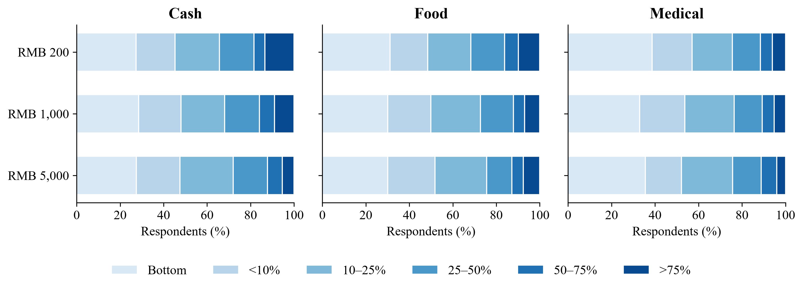
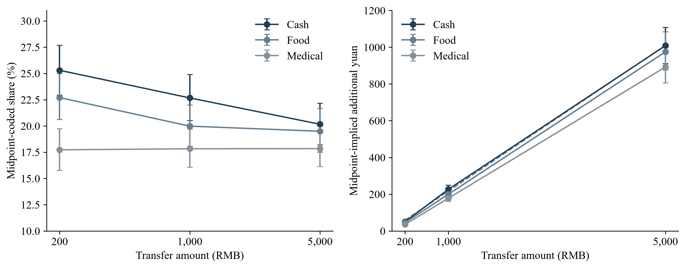
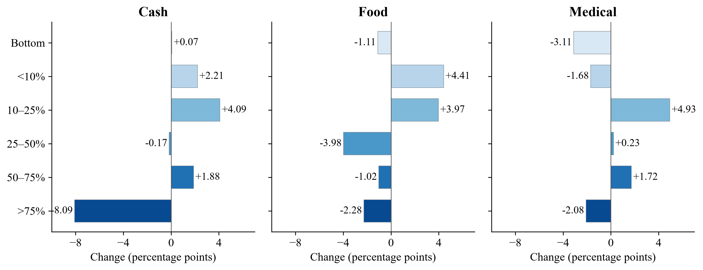
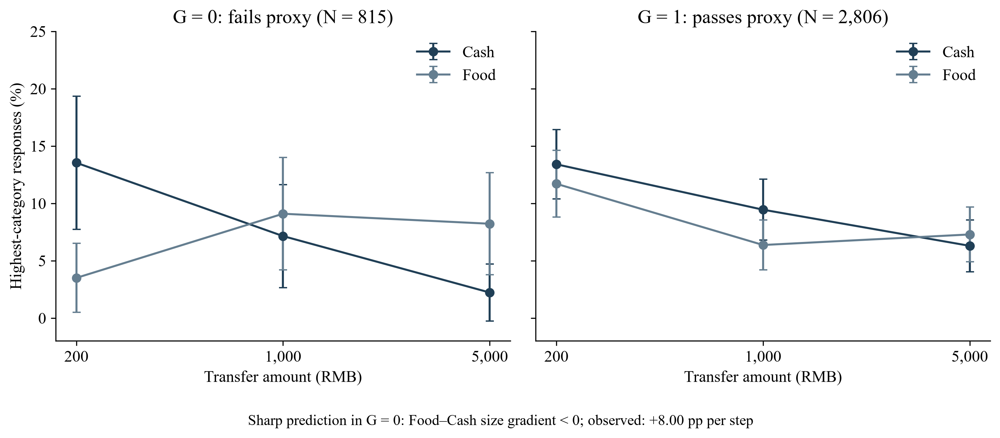

# Transfer form and the allocation of small and large windfalls

## Abstract

Does transfer form matter equally at small and large amounts? A randomized survey experiment assigns 5,480 adults in China to Cash, Food-voucher or Medical-account transfers of RMB 200, 1,000 or 5,000. In the observed cells, Cash spending shares decline with amount, Food declines less, and Medical remains nearly flat; mean differences between forms shrink sharply. The distributions reveal different paths toward these closer means. Cash's highest-response category contracts while its bottom category remains stable. Food shows broader redistribution, and Medical combines offsetting category movements behind a flat mean. Midpoint-implied yuan rises strongly across all three forms, locating the puzzle in allocation shares. A sharp prediction that increasing Food restrictions steepen its decline relative to Cash has the opposite observed sign under an expenditure proxy. Broader need and resource diagnostics are inconclusive at the available precision. Formal cross-form interaction evidence remains uncertain after multiplicity adjustment. We organize the joint pattern around resource categorization: small cash receipts may invite current spending, larger sums broader allocation, and earmarked resources allocation around designated uses. This interpretation concerns hypothetical stated responses to bundled scenarios; the categorization process is not directly measured.

Keywords: transfer size; earmarking; mental accounting; stated spending; response distributions

JEL classification: D12; D14; D91; E21

## 1 Introduction

Does the form of a transfer matter equally when transfers are small and large? Households decide both how much of an unexpected resource to spend and what purposes that resource should serve. A small cash payment can enter everyday purchases; a food voucher arrives with an eligible use; a medical-account balance can remain available for future care. Increasing each from a modest receipt to a substantial sum may change its place in the household budget. Our question is how the contrast between these forms varies with amount, and which parts of the spending-response distribution account for that variation.

A declining finite-windfall spending share is compatible with consumption smoothing and liquidity-based reasoning. A small receipt can finance a pressing purchase, whereas a larger receipt can also replenish savings or cover future needs (Friedman, 1957; Jappelli and Pistaferri, 2010; Kaplan and Violante, 2022). That familiar Cash logic does not by itself explain a flat Medical mean, a gentler Food decline, or sharply narrowing mean gaps between forms. These comparisons introduce questions about eligible uses, substitution and how recipients categorize resources. They also distinguish our question from a search for a universal negative relationship between cash amount and spending share.

We study a randomized survey experiment crossing Cash, Food and Medical transfers with RMB 200, 1,000 and 5,000. Each of 5,480 adults in China answers one hypothetical scenario using six ordered categories of additional total consumption. The midpoint-coded means present three puzzles. First, Cash declines from 25.30% to 22.67% and 20.16%, while Medical remains nearly flat at 17.73%, 17.83% and 17.84%. Second, Food declines less than Cash, from 22.70% to 19.98% and 19.49%, despite the intuition that larger restricted transfers become harder to absorb. Third, mean form differences narrow sharply: the Cash–Medical gap falls from about 7.6 to 2.3 percentage points, and the Cash–Food gap ends below one point. Figure 1 presents the nine underlying distributions. These observed-cell patterns define the puzzles addressed in the paper.

The convergence is in spending shares, not in the disappearance of absolute spending responses. Multiplying each midpoint-coded share by the transfer amount gives implied additional yuan. Cash rises from about RMB 51 to RMB 1,008; Food from RMB 45 to RMB 975; and Medical from RMB 35 to RMB 892. Figure 2 places the scales side by side. A declining share can thus accompany a large increase in implied spending, and a narrowing share gap need not imply a narrowing yuan gap. The economic question concerns how respondents divide a windfall relative to its size.

The distributional anatomy makes that question more precise. Cash's highest-response frequency falls from 13.43% to 5.34%, while its bottom frequency stays near 27.4%. Food shows a smaller top contraction and more diffuse reallocation across the middle. Medical's flat mean combines a shrinking bottom and top with growth in intermediate categories. At RMB 5,000, all three forms have approximately 24% in the 10–25% category, yet their bottom and upper frequencies remain different. Figure 3 makes these distinct paths visible. Mean convergence therefore coexists with different distributional profiles. These comparisons are between independent respondent groups, rather than individual transitions across amounts.

We then ask increasingly demanding questions of this configuration. Ordinary size dependence provides the Cash benchmark; the yuan scale clarifies the allocation problem; bottom-category arithmetic locates the Cash decline away from its lowest response. A sharper account predicts that growing Food restrictions should make its size gradient more negative relative to Cash where eligible expenditure is low. Under the available expenditure proxy, the observed sign is the opposite. Category need, relative income, liquidity and observable household characteristics offer broader explanations, but the available diagnostics do not distinguish them decisively. The sequence identifies what an explanation must accommodate, rather than selecting a mechanism by elimination.

We propose resource categorization across scale as the most coherent organizing interpretation of the joint pattern. Small Cash may be readily assigned to current purchases, while a larger receipt invites a broader decision over consumption, saving, debt and future needs. Food and Medical already carry designated uses. Their mean shares may consequently change less with amount, with Medical's persistent balance allowing different needs to produce offsetting responses. The account connects the distinctive high-response mass for small Cash to the closer means at large amounts. It is an interpretation of the configuration, not a tested ranking of mechanisms: the survey contains no direct measure of categorization or perceived spendability.

The inference distinguishes the observed configuration from a general form-by-size effect. Cash's midpoint and highest-category trends survive adjustment across 42 comparisons; its ordinal trend does not. Cross-form interactions remain uncertain after that adjustment. The strongest statistical evidence is therefore within Cash, while the comparative puzzles concern the observed cells. This distinction guides the analysis without reducing its substantive object to a single coefficient.

The contribution connects evidence on transfer size with evidence on the meaning and use of resources. Fagereng et al. (2021) relate lottery responses to balance sheets; Fuster et al. (2021) find increasing responses to hypothetical gains through their elicited spending-adjustment margin; Andreolli and Surico (2026) document differing size responses across household resources. Jappelli et al. (2026) connect gain size to the timing of intended consumption. Our comparison adds Food and Medical bundles and shows how similar average shares can arise through sharply different category patterns. A direct percentage-bin response describes a different object from Fuster et al.'s filtered adjustment margin.

Mental accounting and budgeting provide a language for those allocation differences (Thaler, 1985, 1999; Shefrin and Thaler, 1988; Heath and Soll, 1996). Labeling studies examine the uses attached to resources (Kooreman, 2000; Abeler and Marklein, 2017), while cash and in-kind studies distinguish eligible-category expenditure from broader consumption (Cunha, 2014; Hastings and Shapiro, 2018; Kan et al., 2017). Bernard (2023) already studies payment mode jointly with shock size. Building on that joint question, our three-amount comparison gives the full response distribution a central role in explaining the Cash, Food and Medical paths.

Real-transfer studies anchor this question in observed behavior. Boehm et al. (2025) compare cash-like and rapidly expiring transfers using realized consumption, and Bonomo et al. (2026) study food-store spending across programmes with different forms and timing. They provide stronger evidence about actual spending; our stated total-consumption distributions address a different outcome and set of resource bundles. Within JEBO, Lee et al. (2024) connect mobile money's social meaning to willingness to spend, and Pauls and Laudi (2025) study temporal framing of a permanent tax cut. Their common concern with resource representation motivates our question about how form and amount jointly shape stated allocation.

Elicitation research defines the scope of that contribution. Shapiro and Slemrod (2003) and Parker and Souleles (2019) study reports about actual rebates; Ueda (2025) examines linked survey and transaction responses in another setting. Crossley et al. (2026) show that direct and filtered questions produce different distributions and relationships with size, horizon and liquidity. We therefore study the allocation expressed through this particular direct-bin instrument. Sections 2 and 3 describe the conceptual setting and design. Sections 4 and 5 establish the puzzles and their anatomy; Sections 6 and 7 develop the explanation and interpretation. Sections 8 and 9 discuss the implications and conclude.

## 2 Conceptual background and related evidence

### 2.1 What a standard consumption benchmark predicts

The permanent-income perspective distinguishes an innovation to resources from a permanent increase in the consumption flow it can sustain (Friedman, 1957). Subsequent work studies borrowing limits, precautionary saving, illiquid assets and adjustment frictions, which change responses to temporary income (Jappelli and Pistaferri, 2010; Kaplan and Violante, 2022). In a setting where additional resources relax a pressing liquidity constraint, a small receipt can have a large consumption share. A larger receipt can extend beyond that need, reducing the average share. This is a plausible account of a declining Cash curve, not a theorem about all finite gains.

The empirical contrast matters. Fagereng et al. (2021) relate responses to lottery gains to prize size and household balance sheets. Fuster et al. (2021) find that larger hypothetical gains prompt more spending adjustments, while Andreolli and Surico (2026) document size responses that differ with household resources. The size and horizon of a shock also interact in Jappelli et al. (2026). A benchmark for our experiment must therefore permit heterogeneous and nonmonotonic responses. The puzzle is whether that broad logic, supplemented by restrictions and timing, can organize the three form-specific distributions.

### 2.2 Labels budgets and transfer form

Mental accounting distinguishes resources by their source or designated use, and mental budgeting can connect expenditure to category-specific budgets (Thaler, 1985, 1999; Shefrin and Thaler, 1988; Heath and Soll, 1996). Labeling evidence in Kooreman (2000) and Abeler and Marklein (2017) provides a reason to consider designated purposes even when substitution is feasible. Lee et al. (2024) further show how a payment instrument can acquire a social meaning through remittances. These accounts motivate a question about categorization, but none makes a single universal prediction for the total-consumption share of our Food or Medical scenario.

Eligible spending is especially important to distinguish from total additional spending. Hastings and Shapiro (2018) find responses of SNAP-eligible food purchases inconsistent with full fungibility in their setting. Cunha (2014) finds that inframarginality can differ between total food and individual items. A voucher may replace purchases already planned, freeing cash for saving or other consumption. An account balance may finance future eligible expenses without creating current additional purchases. Consequently, a high redemption rate, a high category-spending response and a high response in total consumption are different objects. Our question asks about the last, without observing redemption or the reallocation of freed cash.

### 2.3 Why form-by-size predictions are ambiguous

Under full fungibility and otherwise equivalent access and timing, an inframarginal restricted transfer can be equivalent to cash because it substitutes for eligible expenditure already planned. At the other extreme, a restriction that increasingly limits useful absorption can depress the response to a larger transfer relative to cash. That is a sharp conditional prediction requiring assumptions about eligible needs, substitution, expiry and the outcome measured. It cannot be attributed to standard theory in general.

Labels or account structure can also change the relevance of size. Bernard (2023) studies payment modes jointly with shock size, demonstrating the relevance of considering these two dimensions together. Boehm et al. (2025) show that a rapidly expiring card and a cash-like payment generate different realized responses, while Bonomo et al. (2026) study programme form and timing using food-store transactions. Our Medical balance persists, Food expires, and Cash is unrestricted. These descriptions may invite different horizons and allocation problems. An observed interaction would describe those bundles, without identifying a pure label, expiry or liquidity effect.

### 2.4 Stated responses and their units

For transfer T, let S denote a midpoint-coded share and Y = TS its implied yuan value. The finite incremental response between amounts T₁ and T₂ is [E(Y|T₂) − E(Y|T₁)]/(T₂ − T₁). This differs from the endpoint average share and from a local consumption derivative. If Y = a + bT is a useful description over the observed range, then S = a/T + b. A declining share can therefore coexist with almost constant finite increments. The fitted intercept is not spending caused by a zero transfer: zero is outside the experiment.

Elicitation affects what these objects mean. Parker and Souleles (2019) find correspondence between reported and revealed responses to actual rebates, whereas Ueda (2025) reports no significant correspondence in another linked-data setting. Crossley et al. (2026) show that question structure changes estimated patterns. Pauls and Laudi (2025) demonstrate that temporal framing affects intended tax-cut allocations. We retain the original bins, distinguish coding from observation, and treat implied yuan and affine parameters as descriptive transformations of this instrument.

## 3 Design sample and estimands

### 3.1 Nine scenarios and the adult sample

The integrated questionnaire specifies random selection of one of nine versions, and exactly one scenario column is populated in each delivered record. Cash is a one-time unrestricted payment to a bank account or WeChat/Alipay. Food is an electronic voucher for food and daily necessities, valid for six months and noncashable. Medical is a medical-insurance personal-account credit usable for the respondent's and family's medical expenses, with long-term validity and accumulating balances. Each form is crossed with RMB 200, 1,000 and 5,000. All versions ask how much total consumption would exceed the respondent's original plan. There is no common explicit consumption horizon across the three forms.

Table 1. Transfer descriptions and adult cell counts

| Bundle | Eligible use and validity | RMB 200 | RMB 1,000 | RMB 5,000 |
| --- | --- | --- | --- | --- |
| Cash | Unrestricted one-time payment | 618 | 592 | 580 |
| Food | Food and daily necessities; six months | 613 | 619 | 599 |
| Medical | Family medical uses; persistent balance | 614 | 611 | 634 |

Note: N = 5,480 adults. Assignment concerns the complete scenario descriptions. Counts and wording are reproduced from the delivered data and integrated questionnaire; the original Chinese wording and English translation appear in Supplement S9.

The delivered sample has 5,497 responses, including 17 recorded ages below 18. We use the 5,480 respondents aged 18–100. Mean age is 33.3 years, 53.0% are women and 49.2% report a bachelor's degree. The eight fields used for balance diagnostics have no missing adult observations. None of their tests rejects after Holm correction, although sparse income cells limit the chi-square diagnostic. Supplement S1 reports the balance diagnostics, category labels, city-tier information and the 30 observations with a legacy income-band scheme.

Tencent Questionnaire hosted the survey. Recruitment, fieldwork dates, allocation implementation and ethics/consent records await author confirmation. The sample is not established as nationally representative; Supplement S1 describes the available documentation and outstanding collection information.

### 3.2 Response codings and trend inference

The six labels are essentially no additional consumption; approximately below 10%; 10–25%; 25–50%; 50–75%; and above 75%, each with yuan examples. The top example ends at the transfer amount although its verbal threshold is open. We retain all category frequencies. Seven summaries of the same answer are the ordinal score 1–6; midpoint codes 0, 0.05, 0.175, 0.375, 0.625 and 0.875; above-bottom probability; and the four higher category thresholds. Above-bottom is not observed spending participation, because the lowest verbal category is not an exact zero.

Trend models interact form with a log-fivefold amount step: RMB 200 to 1,000 and RMB 1,000 to 5,000 are each one step. The 42-test family combines seven codings with three within-form trends, a cross-form omnibus interaction and two Cash–restricted-form contrasts. We report heteroskedasticity-robust estimates with Holm and joint min-P adjustments. Supplement S3 gives the complete family, earlier interaction tests and simultaneous intervals.

The study was not preregistered. Additional analyses were specified after earlier results were known and before their calculation; Supplement S3 records that sequence. The resulting correction addresses outcome and contrast choice without conferring prospective confirmatory status.

### 3.3 Scales and explanatory comparisons

We compare midpoint shares, their implied yuan values and finite increments between amounts. Cell-stratified bootstrap intervals use 4,000 draws. Affine fits summarize the yuan profiles, and interval-censored sensitivities examine dependence on coding and residual scale (Supplements S4–S5). These are descriptive representations of stated responses.

Explanatory comparisons use the specified Food-expenditure proxy and continuous moderator, followed by category need, income, liquidity and observable characteristics. Supplements S6–S8 retain the model definitions, correction families, sample differences and precision summaries. The comparisons ask how well these measured characteristics organize the pattern across transfer amounts and forms.

## 4 Three puzzles in the randomized cells

### 4.1 Different mean paths toward similar large-amount shares

Table 2 makes the three puzzles visible in nine numbers. Cash falls at both amount steps, Food falls mainly at the first, and Medical barely changes. The endpoint decline is about 5.14 percentage points for Cash and 3.21 for Food, compared with a 0.11-point increase for Medical. The initially large Cash–Medical gap narrows substantially, while the Cash–Food gap reaches about 0.67 points at RMB 5,000. Food occupies an intermediate mean path, while the Cash and Medical means approach one another from very different starting levels.

Table 2. Midpoint-coded shares and implied additional yuan

| Form | RMB 200 | RMB 1,000 | RMB 5,000 |
| --- | --- | --- | --- |
| Cash | 25.30% (50.60) | 22.67% (226.69) | 20.16% (1,008.19) |
| Food | 22.70% (45.40) | 19.98% (199.84) | 19.49% (974.75) |
| Medical | 17.73% (35.46) | 17.83% (178.27) | 17.84% (892.15) |

Note: Parentheses contain transfer amount times mean midpoint code, in RMB. These are implied amounts, not observed expenditure. Finite increments for Cash are 0.220 and 0.195, Food 0.193 and 0.194, and Medical 0.179 and 0.178 over the two successive intervals; Supplement S4 reports all confidence intervals and comparisons.

Figure 1. The three-form, three-amount response atlas. Bars show the six original categories among adults; shades become darker as reported shares increase. Bottom denotes essentially no additional consumption, not an observed zero. Each row contains different respondents. Table 1 gives cell sizes and Supplement S2 gives all frequencies.

The atlas shows why the two restricted forms warrant separate attention. Food and Medical differ in their low-response mass, upper-category frequency and amount path. Pooling them would conceal both Medical's near-flat mean and the different ways the two restricted forms contribute to the observed narrowing of mean gaps.

### 4.2 Percentage convergence is not a collapse of yuan spending

Figure 2 displays midpoint shares and implied yuan with pointwise bootstrap intervals. All forms rise strongly in yuan. The endpoint elasticity of implied yuan with respect to amount is 0.930 for Cash, 0.953 for Food and 1.002 for Medical. The estimates summarize a 25-fold amount change, not a local derivative. In particular, the Cash–Medical implied-yuan gap grows from about RMB 15 to RMB 116 even as the share gap narrows.

Figure 2. The same coded responses on percentage and yuan scales. Whiskers are pointwise 95% percentile intervals from 4,000 cell-stratified bootstrap draws. Dashed lines in the yuan panel are the descriptive form-specific affine fits. The share panel uses a log amount axis; the yuan panel uses a linear amount axis. Neither panel measures realized consumption.

Over RMB 1,000–5,000, finite incremental implied-yuan responses are numerically close, especially for Cash and Food. Their difference is 0.00165 yuan per transfer yuan, with a 95% interval of −0.03486 to 0.03654. The interval allows both similar and meaningfully different responses; equal slopes are not established. Supplement S4 reports all six interval-specific pairwise comparisons, none of which rejects after Holm adjustment.

### 4.3 Which trends retain evidence after accounting for outcome choice

Table 3 separates within-form trends from cross-form comparisons. Cash's midpoint trend retains evidence under Holm42 and min-P42, as does its highest-category trend. The ordinal result does not. The evidence for the coded mean and the highest category is stronger than the evidence for the ordinal-score trend. These are distinct summaries of one categorical response; none is a test that every aspect of the distribution shifts downward.

Table 3. Focal trends within the complete 42-test family

| Outcome and test | Nominal p | Holm42 p | Min-P42 p |
| --- | --- | --- | --- |
| Cash midpoint trend | 0.000956 | 0.0392 | 0.0199 |
| Cash highest-category trend | 0.00000122 | 0.0000514 | 0.000100 |
| Cash ordinal trend | 0.0114 | 0.3995 | 0.1818 |
| Highest-category cross-form omnibus | 0.00903 | 0.3339 | 0.1486 |
| Highest-category Cash–Food trend difference | 0.0124 | 0.4225 | 0.1923 |
| Highest-category Cash–Medical trend difference | 0.00377 | 0.1471 | 0.0686 |

Note: All six rows belong to one family of 42, not a separate six-test correction. The omnibus has two degrees of freedom; scalar rows have one. Min-P uses p values on comparable null scales and 10,000 simulated centered errors; 0.000100 is at the simulation resolution. Complete results and conservative simultaneous intervals appear in Supplement S3.

The highest-category omnibus and both focal cross-form contrasts do not survive the expanded correction; both scalar contrasts have simultaneous intervals containing zero. A steeper Cash tail decline is therefore suggestive despite the detectable within-Cash trend. Medical's near-flat mean and the narrowing mean gaps remain features of the observed cells. The following anatomy explains how those cell means arise.

## 5 Anatomy of the three puzzles

### 5.1 Cash and the contraction of the highest-response category

Cash's endpoint change is concentrated away from the bottom. The essentially-no-additional-consumption category is 27.35% at RMB 200 and 27.41% at RMB 5,000. In contrast, the above-75% category falls from 13.43% to 5.34%, a decrease of about eight percentage points. The 10–25% category rises from 20.39% to 24.48%. The below-10% and 50–75% categories also grow, while 25–50% changes little. Figure 3 displays these changes on a common scale. The contraction at the top coexists with increases in several lower categories, including 50–75%.

Figure 3. Change in response-category shares from RMB 200 to RMB 5,000. Each bar is the larger-amount cell frequency minus the smaller-amount frequency, in percentage points. Panels use the same scale and ordered shades. These are descriptive differences between independent adult cells, with no added tests or significance stars. The six changes within each form sum to zero, subject to rounding.

The coded mean equals the probability of an above-bottom answer times its conditional mean code. The symmetric decomposition attributes −0.02 points of Cash's −5.14-point endpoint change to the probability component and −5.11 points to the conditional-code component, with rounding. Almost all the coded decline therefore lies among the above-bottom categories. This is an arithmetic decomposition of independent cells, not a causal participation or intensive-margin estimate (Supplement S2).

### 5.2 Food and a more diffuse redistribution

Food's bottom frequency falls slightly, from 31.16% to 30.05%, while its highest category falls from 9.79% to 7.51%. Its 10–25% category rises from 19.90% to 23.87%, and its 25–50% category falls from 15.50% to 11.52%. Along with growth below 10%, this produces a smaller mean decline than Cash. The shape involves a broader reallocation across middle and upper categories rather than a top contraction of comparable size.

This distinction matters for the bindingness intuition. A lower mean for Food at the smallest amount is compatible with a restriction or purpose reducing reported additional total consumption. Yet the less negative Food gradient requires a separate explanation; the level comparison does not predict its sign. At RMB 5,000 the Food highest-category frequency, 7.51%, is above Cash's 5.34%. The amount-specific contrast is imprecise (Supplement S3), but the observed crossing makes a simple description of uniformly lower restricted-form responses incomplete.

### 5.3 Medical and offsetting changes behind a flat mean

Medical begins with the largest bottom frequency and the lowest midpoint mean. Between the endpoints, the bottom category falls from 38.60% to 35.49%, the 10–25% category rises from 18.57% to 23.50%, and the 50–75% category rises from 5.54% to 7.26%. At the same time, the highest category falls from 6.03% to 3.94%, and the below-10% category contracts. These opposing contributions leave the coded mean almost unchanged at 17.73% and 17.84%.

Medical's flat mean is not a static distribution; it is the net result of offsetting movements across response categories. In the bottom-code decomposition, a +0.88-point probability component and a −0.76-point conditional-code component nearly cancel. It would therefore be misleading to conclude that amount makes no difference to the observed response distribution merely because the mean is flat. The offsets supply a more informative target for explanation than mean invariance alone.

### 5.4 Convergence without distributional identity

At RMB 5,000, the 10–25% category accounts for 24.48% of Cash, 23.87% of Food and 23.50% of Medical responses. The similar middle-category frequencies coexist with bottom frequencies of 27.41%, 30.05% and 35.49%, and highest-category frequencies of 5.34%, 7.51% and 3.94%. The mean shares converge strongly in the observed cells, but the distributions do not become identical.

The central empirical fact is therefore not merely that the three means move closer. It is that Cash, Food and Medical arrive at those closer means through different distributional paths. An account of Cash's top contraction alone misses Medical's offsets; an account of lower restricted-form levels alone misses Food's gentler decline. These differences set the questions for the explanation that follows.

## 6 Explaining the three puzzles

### 6.1 Consumption smoothing as the starting benchmark

A household can devote much of a small windfall to a pressing purchase and a smaller share of a larger receipt once that need is covered. Cash's declining mean and contracting highest-response category fit this logic. Standard smoothing is therefore a plausible benchmark. Explaining why Food declines less, Medical is nearly flat and their mean gaps narrow requires additional distinctions involving eligible uses, timing or allocation. The comparison across resource forms is where the harder economic question begins.

### 6.2 Scale and the affine description

Larger receipts can support much more spending even when their spending shares fall. An affine yuan profile, Y = a + bT, makes the connection explicit: its share is a/T + b. A positive intercept over the observed range permits a declining share alongside constant finite increments. The midpoint fits describe the cell means reasonably well, but neither common slopes nor an intercept-only explanation is established. The interval-model parameters also depend on residual-scale assumptions and are not structural MPCs (Supplements S4–S5). Scale explains what the puzzle is, not why the three resource forms follow different paths.

### 6.3 Accumulation in the bottom category

Could declining shares simply reflect more answers at the bottom? Cash's bottom frequency stays near 27.4%, and the decomposition locates almost all of its coded mean decline in the above-bottom component. Food and Medical have smaller bottom frequencies at the large amount. Bottom-category accumulation therefore supplies no common account of these paths. The relevant changes lie in the middle and upper categories, with the coding identity and its measurement limits set out in Supplement S2.

### 6.4 Increasing Food bindingness

If a larger voucher becomes harder to absorb in eligible purchases, a sharp prediction is that Food's size gradient should be more negative relative to Cash where eligible expenditure is low. The expenditure proxy distinguishes respondents whose six-month food-band lower bound exceeds RMB 5,000 (G = 1) from those who fail that condition (G = 0). Under this proxy, the prediction is a negative Food–Cash gradient in G = 0.

The observed sign is the opposite. The highest-category Food–Cash gradient in G = 0 is +8.00 percentage points per fivefold amount step, with a 95% interval of 3.83 to 12.18 (Figure 4). Food thus has the less negative gradient in the group to which the sharp prediction applies. This contradicts that prediction conditional on the proxy. Because the expenditure bands are coarse and vouchers also cover daily necessities, the result does not reject all models of binding constraints or substitution.

Figure 4. Food and Cash highest-category responses by expenditure proxy. G = 1 means the six-month food-band lower bound exceeds RMB 5,000; G = 0 fails that condition. Panel Ns are 815 and 2,806 adult Cash/Food respondents. The sharp prediction is a negative Food–Cash size gradient in G = 0; the observed gradient is positive. Whiskers are pointwise normal-binomial cell intervals. The proxy classifies expenditure capacity, not observed voucher bindingness.

The complete ratio-only models, which ask whether amount relative to food expenditure organizes the responses, are also rejected under both specified mappings (Supplement S6). These results leave simple increasing Food bindingness without the pattern it would need to explain Food's gentler decline. They turn attention toward differences in needs and allocation rather than the restriction alone.

### 6.5 Category need

Medical's offsets suggest an economic possibility: some households anticipate useful additional purchases, while others expect the balance to replace planned expenses or remain for later care. Food's broader redistribution may likewise reflect different routine needs. The continuous Food-expenditure comparison examines whether such needs systematically change the Food–Cash size gradient. For the highest category, the estimate is +0.29 percentage points per standard deviation of the ordered expenditure band, with a 95% interval of −2.33 to 2.91. Adjusted estimates and the medical-need diagnostic remain imprecise (Supplements S6–S7). Baseline category need does not provide a clear organizing explanation at the available precision; meaningful heterogeneity remains possible.

### 6.6 Relative income and liquidity

The same transfer can be modest for one household and substantial for another. A relative-resource explanation would organize the pattern by amount compared with income or available liquidity. The relative-income specifications offer only small gains over nominal amount in held-out prediction, and the restrictions do not establish a relative-income law. Income and emergency fundraising capacity are descriptive correlates, with moderator intervals allowing meaningful differences (Supplement S7). Relative financial scale remains plausible, but these measured resources do not parsimoniously organize the three observed paths into one account.

### 6.7 Observable household types

The remaining question is whether readily observed household types or response styles concentrate the pattern. The broad observable screen finds no stable moderator under its corrections and prediction diagnostics. Response-style screens also provide no clear separation, with substantial uncertainty in the stricter subgroup. Their definitions, pass/fail comparisons and the unstable age-by-education calibration appear in Supplements S7–S8. No readily observed type supplies a stable account in these checks, although unobserved or imprecisely measured heterogeneity remains possible.

Table 4 brings these answers together. The positive Food sign is informative against a specific prediction; the other comparisons establish the scope and precision of broader explanations. The joint configuration still calls for an account linking how resources arrive with how their allocation changes across amounts.

Table 4. Economic explanations and the distributional evidence

| Account | Main evidence | Implication |
| --- | --- | --- |
| Consumption smoothing | Cash mean and highest-category frequency decline | Plausible Cash benchmark; the comparative paths require more |
| Scale and affine response | Yuan rises while shares fall; incremental estimates are close | Clarifies allocation shares without establishing equal slopes |
| Bottom accumulation | Cash bottom frequency is stable; Food and Medical bottoms fall | Does not account for the mean paths |
| Sharp Food bindingness | Positive Food–Cash gradient in G = 0 | Opposite to the sharp negative prediction under the proxy |
| Category need | Food moderation interval spans meaningful differences | No clear organizing explanation at the available precision |
| Relative resources | Small prediction gains over nominal amount | No compelling common account of the three paths |
| Observable types | No stable separation in the reported screens | Heterogeneity remains possible |

Note: These comparisons address different economic predictions and use different estimands. They do not jointly identify a mechanism. Full estimates and precision summaries appear in Supplements S4–S8.

## 7 A unified behavioral interpretation

### 7.1 Resource categorization across scale

We propose resource categorization across scale as the most coherent organizing interpretation of the joint pattern. The central idea is that the allocation invited by a receipt depends on both its form and its size. An unrestricted small windfall may be assigned readily to current purchases; a larger sum may prompt consideration of saving, debt and future needs. A resource that arrives with an eligible use already has a place in that decision. The account connects the three observed paths, without requiring the forms to become behaviorally identical at large amounts.

For Cash, the distinctive starting point is the relatively large high-response mass at RMB 200. As amount rises, that mass contracts while the bottom remains stable. In the proposed account, a larger unrestricted receipt invites a broader allocation than an amount that can readily be absorbed into current purchases. The reduction in the small-Cash high-response premium then helps connect its own decline to the narrowing mean gaps.

Food arrives with a designated use. Its lower small-amount mean and less pronounced highest-response mass are consistent with that purpose already shaping allocation. As amount rises, its response distribution changes more diffusely across the middle and top. Medical combines a specified use with a persistent balance. That combination can accommodate both current needs and future care, allowing different responses to offset in the mean. The persistence is an attribute of the scenario; how strongly recipients mentally categorize that balance is part of the proposed explanation.

Together these paths suggest that increasing amount weakens the distinctive small-Cash allocation pattern, bringing the mean shares closer while leaving different bottom and upper frequencies. The survey does not measure the categorization process itself. Perceived spendability is a candidate construct, and the preference for this organizing account is interpretive rather than a tested superiority over competing mechanisms. In particular, the account accommodates Medical's offsets without uniquely predicting their near cancellation.

### 7.2 A direct test of the interpretation

The interpretation leads to a concrete experiment. Fix the consumption horizon and vary labels, eligible-use restrictions, expiry and liquidity separately. Measure perceived spendability and the intended division among current purchases, saving, debt and future needs before observing realized transactions. A manipulation that assigns unrestricted receipts to a broader future budget should reduce the small-Cash high-response premium if categorization drives it; the corresponding effect for already earmarked resources provides a comparative prediction.

Medical's offsets make current needs and anticipated future use especially valuable measurements. Tracking allocations as well as total spending would show whether similar means conceal different responses to the same resource. Randomized categorization prompts and explicit mediation assumptions would be needed to distinguish the proposed process from redemption constraints, substitution or different planning horizons. This design turns the organizing interpretation into a prospectively testable account.

## 8 Discussion

Transfer form is most strongly reflected in mean spending shares at the small end of the observed amount range. The large gaps at RMB 200 are much smaller at RMB 5,000, where Food lies close to Cash and Medical's nearly flat mean is closer to both. This is the comparative contribution of the nine-cell configuration. The corrected cross-form interactions remain uncertain, so the pattern characterizes these observed cells rather than establishing a general law about transfer size.

Similar average shares can conceal different distributional adjustments. Cash's highest category contracts, Food reallocates more broadly, and Medical combines movements that nearly cancel in the mean. Medical makes the point especially clearly: mean flatness leaves substantial differences between its category profiles unexplained. Looking at the full response distribution therefore changes the target of economic explanation, even when it leaves the mean comparison unchanged.

For transfer design, the configuration motivates studying form and size jointly. A comparison at one amount need not describe the allocation problem at another; future real-transfer studies can test that possibility directly. The distinction between shares and yuan also matters. Strongly rising implied yuan accompanies the narrowing share gaps, and absolute yuan gaps can grow. Policy evaluation consequently needs spending amounts, category expenditure, substitution and timing alongside average shares. These stated responses do not rank welfare or aggregate stimulus effects across the three forms.

The design has clear limits. Responses are hypothetical and unincentivized, elicited in approximate bins without a common explicit spending horizon. Form bundles eligibility, expiry and account structure. Recruitment and fieldwork records, allocation implementation and ethics/consent documentation await confirmation, and the sample is not established as representative. The analyses were not preregistered. Cross-form interactions and moderator estimates retain substantial uncertainty; categorization and perceived spendability are unmeasured. These limits define what a follow-up must identify and measure directly.

The central empirical fact is that Cash, Food and Medical approach much closer mean shares through markedly different distributional paths. A distinction pronounced for small receipts is less pronounced in the large-amount means, while the category profiles remain different. Resource categorization offers a coherent hypothesis linking these facts. The next experiment should measure and manipulate that process directly; the present configuration motivates the mechanism without identifying it.

## 9 Conclusion

In the observed cells, Cash spending shares decline with amount, Food declines less, and Medical's mean remains nearly flat. The closer large-amount means emerge through top-category compression, diffuse redistribution and offsetting changes, respectively. Implied yuan rises strongly throughout, locating the puzzle in allocation shares. The sharp simple Food-bindingness prediction has the opposite sign under the expenditure proxy. Resource categorization across scale provides an organizing hypothesis for the joint pattern and a target for direct experimental testing. The configuration suggests that transfer size changes how strongly resource form is reflected in stated spending allocation.

## Author declarations

Author identities, affiliations, recruitment and ethics statements, funding, competing interests and CRediT contributions are pending verified author information. Data availability: aggregate source tables and reproducible materials accompany this draft; access to respondent-level records is subject to confirmation of consent and sharing permissions. These draft declarations require completion before submission.

## Declaration of generative AI and AI-assisted technologies in the manuscript preparation process

OpenAI ChatGPT/Codex supported literature checking, drafting, revision and preparation of analysis scripts. Statistical outputs were computed with Python libraries; the present writing refinement reuses those results and figures unchanged. Human author review, editing and confirmation of responsibility remain pending before submission.

## References

Abeler, J., Marklein, F., 2017. Fungibility, Labels, and Consumption. Journal of the European Economic Association 15, 99-127. https://doi.org/10.1093/jeea/jvw007

Andreolli, M., Surico, P., 2026. ‘Less Is More’: Consumer Spending and the Size of Economic Stimulus Payments. American Economic Journal: Macroeconomics 18, 34-68. https://doi.org/10.1257/mac.20220169

Bernard, R., 2023. Mental Accounting and the Marginal Propensity to Consume. Deutsche Bundesbank Discussion Paper, 13/2023. https://www.bundesbank.de/en/publications/research/discussion-papers/mental-accounting-and-the-marginal-propensity-to-consume-909438

Boehm, J., Fize, E., Jaravel, X., 2025. Five Facts about MPCs: Evidence from a Randomized Experiment. American Economic Review 115, 1-42. https://doi.org/10.1257/aer.20240138

Bonomo, T., Ruffini, K., Schanzenbach, D.W., 2026. Is a Dollar a Dollar? How Transfer Design Shapes Household Spending. NBER Working Paper, 35698. https://doi.org/10.3386/w35698

Crossley, T.F., Fisher, P., Levell, P., Low, H., 2026. Eliciting the marginal propensity to consume in surveys. Federal Reserve Bank of Chicago Working Paper, 2026-04. https://www.chicagofed.org/publications/working-papers/2026/2026-04

Cunha, J.M., 2014. Testing Paternalism: Cash versus In-Kind Transfers. American Economic Journal: Applied Economics 6, 195-230. https://doi.org/10.1257/app.6.2.195

Fagereng, A., Holm, M.B., Natvik, G.J., 2021. MPC Heterogeneity and Household Balance Sheets. American Economic Journal: Macroeconomics 13, 1-54. https://doi.org/10.1257/mac.20190211

Friedman, M., 1957. A Theory of the Consumption Function. Princeton University Press. https://www.nber.org/books-and-chapters/theory-consumption-function/permanent-income-hypothesis

Fuster, A., Kaplan, G., Zafar, B., 2021. What Would You Do with $500? Spending Responses to Gains, Losses, News, and Loans. The Review of Economic Studies 88, 1760-1795. https://doi.org/10.1093/restud/rdaa076

Hastings, J., Shapiro, J.M., 2018. How Are SNAP Benefits Spent? Evidence from a Retail Panel. American Economic Review 108, 3493-3540. https://doi.org/10.1257/aer.20170866

Heath, C., Soll, J.B., 1996. Mental Budgeting and Consumer Decisions. Journal of Consumer Research 23, 40-52. https://doi.org/10.1086/209465

Jappelli, T., Pistaferri, L., 2010. The Consumption Response to Income Changes. Annual Review of Economics 2, 479-506. https://doi.org/10.1146/annurev.economics.050708.142933

Jappelli, T., Savoia, E., Sciacchetano, A., 2026. Intertemporal MPC and shock size. European Economic Review 186, 105303. https://doi.org/10.1016/j.euroecorev.2026.105303

Kan, K., Peng, S., Wang, P., 2017. Understanding Consumption Behavior: Evidence from Consumers' Reaction to Shopping Vouchers. American Economic Journal: Economic Policy 9, 137-153. https://doi.org/10.1257/pol.20130426

Kaplan, G., Violante, G.L., 2022. The Marginal Propensity to Consume in Heterogeneous Agent Models. Annual Review of Economics 14, 747-775. https://doi.org/10.1146/annurev-economics-080217-053444

Kooreman, P., 2000. The Labeling Effect of a Child Benefit System. American Economic Review 90, 571-583. https://doi.org/10.1257/aer.90.3.571

Lee, J.N., Morduch, J., Ravindran, S., Shonchoy, A.S., 2024. The social meaning of mobile money: Earmarking reduces the willingness to spend in migrant households. Journal of Economic Behavior & Organization 221, 675-688. https://doi.org/10.1016/j.jebo.2024.04.023

Parker, J.A., Souleles, N.S., 2019. Reported Effects versus Revealed-Preference Estimates: Evidence from the Propensity to Spend Tax Rebates. American Economic Review: Insights 1, 273-290. https://doi.org/10.1257/aeri.20180333

Pauls, T., Laudi, M., 2025. Temporal framing of tax stimuli and household consumption. Journal of Economic Behavior & Organization 235, 107079. https://doi.org/10.1016/j.jebo.2025.107079

Shapiro, M.D., Slemrod, J., 2003. Consumer Response to Tax Rebates. American Economic Review 93, 381-396. https://doi.org/10.1257/000282803321455368

Shefrin, H.M., Thaler, R.H., 1988. The behavioral life-cycle hypothesis. Economic Inquiry 26, 609-643. https://doi.org/10.1111/j.1465-7295.1988.tb01520.x

Thaler, R., 1985. Mental Accounting and Consumer Choice. Marketing Science 4, 199-214. https://doi.org/10.1287/mksc.4.3.199

Thaler, R.H., 1999. Mental accounting matters. Journal of Behavioral Decision Making 12, 183-206. https://doi.org/10.1002/(sici)1099-0771(199909)12:3%3C183::aid-bdm318%3E3.0.co;2-f

Ueda, K., 2025. The reality of consumption: Comparing self-reported and observed marginal propensity to consume. Economics Letters 247, 112179. https://doi.org/10.1016/j.econlet.2025.112179
